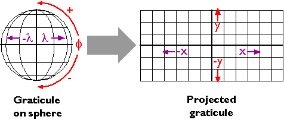
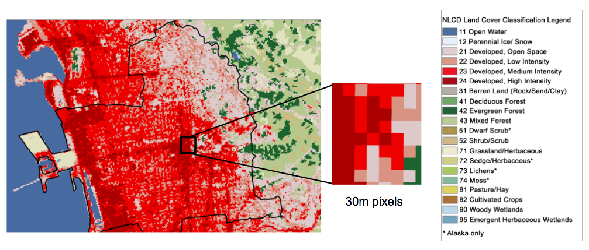

```{r setup, include=FALSE}
knitr::opts_chunk$set(echo = T)
```

# Geospatial Data in R

## Workshop Goals

* Intro to geospatial data 

* Intro to coordinate reference systems (CRS)

* Classes & methods for working with spatial data in R

* Mapping geospatial data

* Practice


## About Me

Patty Frontiera

Dlab.berkeley.edu

## About you

Who are you?

Why are you here?


## Before we begin

1. Download the workshop files

2. Install any required libraries


## Geographic Data


## Geographic Data

Data about locations on or near the surface of the Earth.

</img>


## Place names

Convey geographic information but don't specify location on the surface of the Earth.

</img>


## Geospatial data

represent location geometrically with coordinates

`46.130479, -117.134167`
  
</img>


## Coordinate Reference System

Coordinates indicate specific locations on the Earth when associated with a geographic `coordinate reference system` or **CRS**. 

</img>

## Geographic CRS

Specifies 

1. the shape of the Earth (major & minor polar axis)
2. the origin (equator, prime meridian)
3. fit of the CRS to the Earth (center of the earth)
4. units (lat/lon expressed as decimal degrees or dms)

Because of variations in 1-3, there are many geographic CRSs!

The [World Geodetic System of 1984](https://en.wikipedia.org/wiki/World_Geodetic_System) is the default geographic CRS used today.

## Map Projections

A `Projected CRS` applies a **map projection** to a Geographic CRS

`Map Projection`: mathematial transformation from curved to flat surface

</img>


## Projected CRSs

There are many, many projected CRSs

All introduce distortion, eg in shape, area, distance, direction

No best one for all purposes

Selection depends on location, extent and purpose

##  Different CRSs

</img>


## Spatial Data

Spatial data is a more generic term that is not just for geographic data. 

Spatial data are powerful because

- dynamically determine spatial metrics like area and length, 
- characteristics like distance and direction, and 
- relationships like inside and intersects from these data.

# Types of Spatial Data


## Vector Data

Points, lines and Polygons

</img>

## Raster Data

Regular grid of cells (or pixels)

</img>


# Geospatial Data in R

## Geospatial Data in R

There are many approaches to and packages for working with geospatial data in R.

One approach is to keep it simple and store geospatial data in a data frame

##

```{r }
cafes <- read.csv('data/cafes.csv')
head(cafes)

```
## Plot of points

```{r}
plot(cafes$long,cafes$lat)
```

## Fancy plots with `ggplot2` and `ggmap`
```{r, eval=F}
library(ggplot2)
library(ggmap)
ggplot() + geom_point(data=cafes, aes(long,lat), col="red", size=2)
```
</img>

## BUT!

There are advantages to storing geographic data as spatial objects.


## Why we like spatial objects

* Data cleaning! Before Mapping

* Better management of complex spatial representations
    * CRS tranformations and geoprocessing

* Compute spatial metrics and relationships

* Data linkages - when data are in same CRS


# sp Package

## The `sp` Package

**Classes and Methods for Spatial Data**

The `SP` package is most commonly used to construct and manipulate spatial data objects in R. 

Hundreds of other R packages that do things with spatial data typically build on SP objects.

## `sf` package

The `sf`, or `simple features` package in R has many improvements

Based on open standards for specifying spatial data

But most spatial packages still depend on `sp`

So, live on the bleeding edge or check back in a year or so.


## `sp` package

```{r}
library(sp)
getClass("Spatial") # See all sp object types
```

 
```

## sp Vector Objects
 Geometry | Spatial Object | Spatial Object with Attributes 
 ---------| --------------- | ------------------------------
 Points | SpatialPoints | SpatialPointsDataFrame 
 Lines | SpatialLines | SpatialLinesDataFrame< 
 Polygons | SpatialPolygons | SpatialPolygonsDataFrame
 
<pre>

</pre>
We use the S*DF objects most frequently!

## Let's take a look

## Read in point Data

Airbnb Rental data from http://insideairbnb.com

```{r}
rentals <- read.csv('data/sf_airbnb_2bds.csv')
class(rentals)
dim(rentals)

```

## Examine Data Structure
```{r}
str(rentals)
```

## Examine Data Content
```{r}
head(rentals)
```

## Visualize Data
```{r}
hist(rentals$price)
```

## Process Data
```{r}
cheap <- subset(rentals, price < 401)
hist(cheap$price)
```

## Process Data Some More
```{r}
cheap_good <- subset(cheap, review_scores_rating > 98)
hist(cheap$price)
```


# From Data Frame to SpatialPointsDataFrame


## Create a SpatialPointsDataFrame

Use the `sp::coordinates()` method

Requires a vector indicating the x,y columns

SP will create a `SpatialPointsData` Fram from csv

## SpatialPointsDataFrame (SPDF)
```{r}

#First make a copy
cheap_good_orig <- cheap_good

coordinates(cheap_good) <- c('longitude','latitude')
class(cheap_good)
```

## Compare SPDF to DF
```{r}
str(cheap_good_orig)
```

## SPDF
```{r, eval=F}
str(cheap_good)
```
</img>

## SPDF Slots

You can see from **str(cheap_good)** that a SPDF object is a collection of slots or components. The key ones are:

- `@data` data frame of attributes that describe each location
- `@coords` the coordinates for each location
- `@bbox` the min and max bounding coordinates
- `@proj4string` the coordinate reference system defintion as a string

## SPDF Slots
 
Review the output of each of these:

```{r, eval=F}
summary(cheap_good)
head(cheap_good@coords)
head(cheap_good@data)
cheap_good@bbox
cheap_good@proj4string
```


## What's missing

Are all the columns that were present in the DF now in the SPDF?

Is there a slot without data?


## What is the CRS of the data?
```{r}

cheap_good@proj4string # get a CRS object

```

## Define a CRS

Defining the CRS of a spatial data object enables the software to locate the coordinates in a specific space.

Geospatial-aware software will have definitions for supported Earth referenced coordinate systems

For example...


## To define a CRS

You need to know 

- the specific CRS for the data
- how to define the CRS object
- how to assign it to the spatial data

## Define  & Assign a CRS

Known as `defining a projection` in ArcGIS

**Defining a CRS != Transforming CRS**

- Defining does nothing to the coordinates themselves

We will get to transformations soon!

## CRS Objects

Need the `proj4` string or code that defines the CRS

[proj4](http://proj4.org/) is a widely used library of CRS definitions and functions.


## Let's do this

`sp` includes the `CRS()` function for creating a CRS object

- See ?CRS for details

```{r}
# Create a CRS object from its proj4 string
WGS84_CRS <- CRS("+proj=longlat +datum=WGS84 +no_defs 
                    +ellps=WGS84 +towgs84=0,0,0") 

# Set the CRS of the SPDF
proj4string(cheap_good) <- WGS84_CRS

# check it
cheap_good@proj4string
```

## Two other ways to define the CRS

```{r, eval=F}

# or use the EPSG code directly
proj4string(cheap_good) <- CRS("+init=epsg:4326") 

# or enter the string
proj4string(cheap_good) <- CRS("+proj=longlat 
                               +ellps=WGS84 +datum=WGS84 +no_defs")  

```


## Define Incorrectly?

What happens if we assign the wrong CRS?

or not at all?

Software doesn't care but you need to!


## Make sure it is defined correctly

```{r, eval=F}

# 4326 is the code for WGS84
proj4string(cheap_good) <- CRS("+init=epsg:4326") 

```


## Finding CRS Codes

See [http://spatialreference.org/](http://spatialreference.org/)

Use this site to find EPSG codes and proj4 CRS strings

Because I can't remember a CRS string but I can remember ~10 codes

## Common CRSs

**Geographic**

* `4326` Geographic, WGS84 (default for lon/lat)

* `4269` Geographic, NAD83 (USA Fed agencies like Census)

**Projected**

* `5070` USA Contiguous Albers Equal Area Conic

* `3310` CA ALbers Equal Area

* `26910` UTM Zone 10, NAD83 (Northern Cal)

* `3857` Web Mercator (web maps)


## Challenge

Use [http://spatialreference.org/](http://spatialreference.org/) to make an educated guess as to the CRS of these coordinates:

X = 549228.058249, Y = 4176578.444299

Strategy:

- review the bounding box coordinates for the CRSs referenced by the above codes.

## Challenge 2

What are the `units` for that CRS?


# Mapping Spatial Objects

## plot

You can use the standard R plot command to make a basic map of one or more `sp` objects.

```{r}

plot(cheap_good)

```

## `plot` options

You can enhance the basic plot with custom graphical parameters.

See: see the [Quick-R website's](http://www.statmethods.net/advgraphs/parameters.html) page for graphical parameters.


```{r}

plot(cheap_good, col="red", bg="lightblue", pch=21, cex=2)

```


## spplot

`sp` includes a plotting method `spplot`

Use it to create quick maps

Or to create great maps 

But complex, non-intuitive syntax = long ugly code

See examples in [sp Gallery: Plotting maps with sp](https://edzer.github.io/sp)


## `spplot` of the rental data by price
```{r}

spplot(cheap_good,"price")

```

## Challenge

Use `spplot` to create data maps from some of the other columns in the @data slot

Getting help:

`?spplot`


## Examples
```
spplot(cheap_good,"bathrooms")

spplot(cheap_good,"accommodates")

spplot(cheap_good,"property_type")

spplot(cheap_good,"neighbourhood")

```
# Spatial Data File formats

## Common Spatial Data File formats

Vector points, lines & polygons:

* CSV
* [ESRI Shapefile](https://en.wikipedia.org/wiki/Shapefile)
* GeoJSON
* KML

Raster grids

* TIFF, GeoTiff
* JPEG, JPEG2000
* ASCII Grid

See [GIS file formats](https://en.wikipedia.org/wiki/GIS_file_formats)

## ESRI Shapefile

This is one of the most, if not the most common spatial vector data file formats.

</img>

Old but everywhere!

Gotchas: 2GB limit, 10 char column names, poor unicode support

## Reading in Geospatial Data

There's an R package for that! 

## `rgdal`

`rgdal` is an R port of the powerful and widely used [GDAL](http://gdal.org) library.

It is the most commonly used R library for importing and exporting spatial data. 

* `OGR`: for vector data: readOGR() and writeOGR()

* `GDAL` for raster data: readGDAL() and writeGDAL()

## `rgdal`

```{r}

library(rgdal)

# See what file types are supported by rgdal drivers
# ogrDrivers()$name

```

## Getting help

gdal.org

`?readOGR

For more info on working with `rgdal` to load different types of spatial data in R see this excellent [tutorial](http://zevross.com/blog/2016/01/13/tips-for-reading-spatial-files-into-r-with-rgdal/) by Zev Ross.


## Read in Shapefile

```{r}

sfboundary <- readOGR(dsn="data",layer="sf_boundary")

```

## Read in Shapefile

```{r}

sfboundary <- readOGR(dsn="data",layer="sf_boundary")

# or
# sfboundary <- readOGR("data","sf_boundary")
# but not
#sfboundary <- readOGR(dsn="data/",layer="sf_boundary")

```

## Check out the data structure

```{r, eval=F}
str(sfboundary)  
summary(sfboundary)
```

## Make a quick plot to check the data

How?

## Make a quick plot to check the data
```{r}

plot(sfboundary)

```


## Take a look at the attribute data

How?

## Take a look at the attribute data

```{r}
head(sfboundary@data)   
```

## Take a look at the CRS info

How?

## Take a look at the CRS info

Is it defined? Geographic or projected CRS?

```{r}

sfboundary@proj4string

```


## Plot with Rental Data
```{r}

plot(sfboundary)
points(cheap_good, col="red")

```

## Plot with Rentals

Where are the points?

```{r}
plot(sfboundary)
points(cheap_good, col="red")
```

## What's Wrong?

Compare the CRSs, are they the same?

```{r, eval=F}

proj4string(sfboundary)
proj4string(cheap_good)
proj4string(sfboundary) == proj4string(cheap_good)

```

## Compare the CRSs, are they the same?

```{r}

proj4string(sfboundary)
proj4string(cheap_good)
proj4string(sfboundary) == proj4string(cheap_good)

```

## Compare the coord data

```{r}
sfboundary@bbox
cheap_good@bbox
```

## CRS Problems

The #1 reason...

</img>

## CRS Transformations

All geospatial data should have the same CRS.

When they don't, they need to be transformed to a common CRS.

- especially for spatial analysis

This is also called a projection transformation, 

- or `projecting` or `reprojection`.


## Transform the CRS

Use `sp` function `spTransform`

Requires as input:

* a spatial object to transform with a defined CRS
    * *Input spatial object must have a defined CRS*
    
* a CRS object that indidicates the target CRS

Outputs a new spatial object with coordinate data in the target CRS

- It does not transform the source data!

## Transform `sfboundary`

```{r}

sf_lonlat <- spTransform(sfboundary, WGS84_CRS)


```

## Did it work?

How will we know?

## Do the CRSs match?

```{r, eval=F}
proj4string(cheap_good) == proj4string(sf_lonlat)

```

## Overlay the data in space

```{r}
plot(sf_lonlat)
points(cheap_good, col="red")
points(cheap_good[cheap_good$price<100,], col="green", pch=19)

```

## spTransform 4 Ways

Use CRS to that of another data layer
```
sf_lonlat <- spTransform(sfboundary, CRS(proj4string(cheap_good)))
```

Use CRS string
```
sf_lonlat <- spTransform(sfboundary, CRS("+proj=longlat +ellps=WGS84 
    +datum=WGS84 +no_defs"))
```

USE CRS code
```
sf_lonlat <- spTransform(sfboundary, CRS("+init=epsg:4326"))
```

Use a CRS object
```
WGS84_CRS <- CRS(proj4string(cheap_good))
sf_lonlat <- spTransform(sfboundary, WGS84_CRS)
```

## Save the shapefile

Use writeOGR to save `sf_lonlat` to a new shapefile

See `?writeOGR` for help
```{r, eval=F}
# write transformed data to a new shapefile 
writeOGR(sf_lonlat, dsn = "data", layer =  "sf_bounary_geo", 
          driver="ESRI Shapefile")

# is it there?
dir("data")
```

## Projections, CRS, oh my!

We want all data in the same CRS

Which one is best?

</img>

# Line Data

## Line Data

Let's read in some `line` data

In the popular [GeoJSON](http://geojson.org) file format 

</img>


## Reading in GeoJSON File

```{r}
sf_streets <- readOGR(dsn='data/sf_highways.geojson', layer="OGRGeoJSON")
```

##  GeoJSON

WARNING: Reading & writing GeoJSON can be tricky! 

[Search for GeoJSON in this tutorial](http://zevross.com/blog/2016/01/13/tips-for-reading-spatial-files-into-r-with-rgdal/)!

## Plot the data
```{r}
plot(sf_streets)

```

## Examine the data

```{r, eval=F}
str(sf_streets)
summary(sf_streets)
```

- What is the CRS of the data?
- Are the data projected?
- Does the CRS match that of the other layers?

## Challenge

Plot all the data on one map

How do we do that?

Recall our earlier examples.

## Map all the data

```{r}
plot(sf_lonlat)
lines(sf_streets)
points(cheap_good, col="red")
points(cheap_good[cheap_good$price<200,], col="green")
```

## Order Matters

Layers draw in order added to plot.

*The GIS Layer Cake*

Should be: Rasters > Polygons > Lines > Points

Order can also matter for Features!

## Disorder - where are the points?

```{r}
plot(cheap_good, col="red")
lines(sf_streets)
plot(sf_lonlat, add=TRUE)  # note syntax
```


## RECAP

* Read & write data in CSV, Shapefile and GeoJSON formats 
    * `coordinates()` - data frame to SPDF  
    * `rgdal::readOGR and writeOGR`
    
* Created Spatial*DataFrames

* Defined CRS with `proj4string()`

* Transformed CRS with `spTransform()`

* Mapped data with `plot()` and `spplot`

* Mapped multiple geospatial data layers

* Terminology

# QUESTIONS?

## Data Driven Maps

## Data Driven Maps

Also called thematic maps or data maps

Use data values to determine symbology

Use symbology to convey data values / meaning

Important for all phases of the research process, from exploratory analysis through reporting results.


## R packages for Mapping

Lots of them

Let's quickly discuss the most common ones

##  `plot`

Pros

* Quick basic maps
* Easy to map multiple layers
* Works with sp objects

Cons

* Requires lots of complex code to make pretty


##`spplot`

Pros

* Quick thematic maps of one layer
* More config options for sp objects than plot

Cons

* Pretty maps require lots of complex code

## `ggplot2` and `ggmap`

Pros

* beautiful maps with `ggplot2`
* builds on existing R knowledge of `ggplot2`
* Some great geospatial data functionality in `ggmap`
* works with data frames

Cons

* Doesn't work with `sp` objects
* Limited support for CRS and spatial operations
    * Expects geographic coordinates (longitude and latitude) as input
* Complex syntax and methods

##`tmap`

Pros

* Quick and powerful maps
* Works with `sp` objects & CRSs
* Syntax similar to but not as complex as `ggplot2`
* Easy to save as `static` or `interactive` tmaps

Cons

* No basemaps in static mode

## `leaflet`

Pros

* R port of the popular Javascript library

* Allows one to create interactive maps that can be served on web

* Highly customizeable!

Cons

* Highly customizeable!

# tmap

## tmap

`tmap` stands for thematic map

Great maps with less code than the alternatives

Syntax should be familar to ggplot2 users, but simpler

Good starting points

- ?tmap
- vignette("tmap-nutshell")
- vignette("tmap-modes")
- [tmap in a Nutshell](https://cran.r-project.org/web/packages/tmap/vignettes/tmap-nutshell.html) 


## tmap

Load the library

```{r}
library(tmap)

```


## US Population by State

Let's explore population data for US states.

Data are in the file `data/us_states_pop.shp`


**Challenge**

Use `readOGR` to load it and `plot` to view it

## Read in & plot the Data
```{r}
uspop <- readOGR("./data", "us_states_pop")

plot(uspop)
```

## Basic Questions

Review the Data with commands we used earlier

- What type of data object is `usopen`

- How many features does it contain?

- How many attributes describe those features?

- What is the CRS?


## Quick tmap - `qtm`

Make a quick plot with default options

```{r}

qtm(uspop)

```

## `qtm` of a data value

```{r}
qtm(uspop,"POPULATION")
```

## `tmap` Shapes and Graphic Elements

tmap's flexibility comes in how it intitively allows you to layer spatial data and style the layers by data attributes

Use `tm_shape(<sp_object>)`  to specifiy a geospatial data layer

Add `+ tm_<element>(...)` to style the layer by data values

...and other options for creating a publication ready map


## Exploring `tmap` functionality

`?tm_polygons`

</img>


## Customizing the display

```{r}
tm_shape(uspop) + tm_polygons(col="beige", border.col = "red")

```

## or

```{r}
tm_shape(uspop) + tm_polygons(col="#f6e6a2", border.col = "white")
```


## Challenge

Create a `tmap` of Population with different fill and outline colors

You can use color names or HEX values

- [http://www.color-hex.com](http://www.color-hex.com)

See `?tm_polygons` and try customizing another parameter

## My Map

```{r}
tm_shape(uspop) + tm_polygons(col="#f6e6a2", border.col = "black", alpha=0.5, lwd=0.5)

```

## CRS and Shape

Notice anything odd about shape of USA?
```{r}
tm_shape(uspop) + tm_polygons(col="#f6e6a2", border.col = "white")
```

## Projected CRSs for Mapping

Setting the CRS Dynamically

```{r}
tm_shape(uspop, projection="+init=epsg:5070") + tm_polygons(col="#f6e6a2", border.col = "white")
```

## Dynamic CRS Transformations

Also called `On-the-fly reprojection` in ArcGIS & QGIS

Very cool!

BUT, if you want to use data in a different CRS it is best to transform it.

## Challenge

* Transform the `uspop` data to the USA Contiguous Albers CRS (5070),

* Save output as a new `SpatialPolygonsDataFrame` called `uspop_5070`

## uspop_5070
```{r}
uspop_5070 <- spTransform(uspop, CRS("+init=epsg:5070"))

```

## Plotting the Transformed Data

```{r}
tm_shape(uspop_5070) + tm_polygons(col="#f6e6a2", border.col = "white")
```

## What's happening here?

```{r}
tm_shape(uspop_5070) + tm_polygons(col="#f6e6a2", border.col="#f6e6a2") +
tm_shape(uspop) + tm_borders(col="purple")
```


# Choropleth Maps

## Choropleth maps

`Color areas by data values`

Fun name for a type of data map

Sometimes called `heatmap`

## Choropleth Map of State Population

```{r}
tm_shape(uspop_5070) + tm_polygons(col="POPULATION")
```

## Keys to Great Choropleth Maps

1. Color Palettes

2. Data Classification


# Color

## rColorBrewer Package

The R package `RColorBrewer` is widely used to select color palettes for maps. 

Read the package help for more info.

`?RColorBrewer` or see [colorbrewer.org](http://colorbrewer2.org/)

```{r }
library(RColorBrewer)
```

## Exploring Brewer Palettes

Use `display.brewer` functions to see available color palettes.

```{r }
display.brewer.all()

```

## Qualitative Color Palettes

Complementary colors, e.g. pastels, to emphasize different categories not magnitudes or order.

```{r}
display.brewer.all(type="qual")
```

## Sequential Color Palettes

Light to dark shades of the same or complimentary colors to imply order, e.g. higher to lower ranks or values

```{r}
display.brewer.all(type="seq")
```

## Divergent Color Palettes

Two contrasting sequential color palettes at either end to emphasize outliers with a lighter palette in the middle to reveal trends.

```{r}
display.brewer.all(type="div")
```


## Applying a Color Palette


```{r}
tm_shape(uspop_5070) + tm_polygons(col="POPULATION", palette="BuPu")
```

## Challenge

Try a sequential, divergent and qualitative color palette with this dataset.

Set `auto.palette.mapping=FALSE` and TRUE with the `SPECTRAL` palette.

- You can read about this option in `?tm_polygons`

##

```{r}
tm_shape(uspop_5070) + tm_polygons(col="POPULATION", palette="Spectral", 
                                auto.palette.mapping=FALSE)
```

# Data classification

## Why Data classification

Unclassified maps scale full range of values to color palette

- Great for exploring trends and outliers, 

- but hard to interpret specific data values.

- The eye can only differentiate a few colors.

## Data classification

Important for improving the cartographic display of continuous data

Reduces complexity by grouping continuous values into a small number of bins, typically 5-7. 

Unique symbology - color - is then associated with each bin.

A legend indicates the association, making it easier to interpret data values.


## Data Classification Methods

Common methods for binning data into a set of classes include:

- `equal interval`: classes the data into bins of equal data ranges, e.g. 10-20, 20-30, 30-40.

- `quantile`: classes the data into bins with an equal number of data observations. This is the default for most mapping software.

- `fisher/jenks/natural breaks`: classes data into bins that minmizie within group variance and maximize between group variance.

- `standard devation`: classes emphasize outliers by classing data into bins based on standard deviations around the mean, eg -2 to + 2 SDs.

## Data classification in `tmap`

`tmap` uses the classificaiton methods in the `classIntervals` package

The class method is set by the `style` parameter in `tm_polygons` 
- or other style element, eg `tm_symbols`

See `?tm_polygons` for keyword options

## `tmap` data classification - Quantiles

```{r}
tm_shape(uspop_5070) + tm_polygons(col="POPULATION", style="quantile")
```

## `tmap` data classification - Jenks

```{r}
tm_shape(uspop_5070) + tm_polygons(col="POPULATION", style="jenks")
```

## Challenge

Try a different classification scheme.

Note how it impacts the display of the data and thus communicate different messages

What is the default classification scheme used by `tmap`?

## Number of Classes

In addition to setting the classification method you can set the number of classes, or cuts.

By default this is 5

Explore setting it to 3 or 9 with `n=`

```{r, eval=F}
tm_shape(uspop_5070) + tm_polygons(col="POPULATION", palette="BuPu", 
                                    style="jenks", n=9)
```


## Cartography

The Art and Science of Map Making

Science: 

* the data, the domain,
* choice of classification scheme

Art: 

* communication & visualization theory
* choice of color, shape, size, transparency, weight, context

## Challenge

Map `popdens` instead of POPULATION

Don't use defaults

- Set color palette and classification style


## Faceting

```{r}
tm_shape(uspop_5070) + tm_polygons(col=c("POPULATION","popdens"), 
                              style=c("jenks","jenks"))
```


## Mapping Polygons

Sometimes polygons get in the way of what you want to communicate. Why?

What state has the greatest population density?

```{r}
tm_shape(uspop_5070) + tm_symbols(col="popdens", style="jenks")
```


## Polygons as Points

Use `tm_symbols` to map the data as points

```{r}
tm_shape(uspop_5070) + tm_symbols(col="popdens", style="jenks")
```

## Mapping multiple layers 

```{r}
tm_shape(uspop_5070) + tm_polygons(col="white", border.alpha = 0.5) + 
  tm_shape(uspop_5070) + tm_symbols(col="popdens", style="jenks")
```

## Point Map Terminology

`Graduated Color Map` when data are classified

`Proportional Color Map` when they are not
  
```{r, echo=F}
tm_shape(uspop_5070) + tm_polygons(col="white", border.alpha = 0.5) + 
  tm_shape(uspop_5070) + tm_symbols(col="popdens", style="jenks")
```


## Challenge

Change the marker shape to square
```{r, echo=F}

  tm_shape(uspop_5070) + tm_squares(col="popdens", style="jenks")
```

## Symbol Maps

We have using color to communicate data values.

We can also use size.

Proportional and Graduated Symbol maps
vary symbol size by data value

## Graduated Symbol Maps

What changed to make a **symbol** not **color** map?

```{r}
tm_shape(uspop_5070) + tm_polygons(col="white", border.alpha = 0.5) + 
  tm_shape(uspop_5070) + tm_symbols(size="popdens", style="jenks")
```

## Challenge

Take a look at `?tm_symbols` and adjust the graduated symbol map

Change the outline and fill colors of the point symbols and add fill transparency.

Also customize the legend title

## Take 2

```{r, eval=F}
tm_shape(uspop_5070) + tm_polygons(col="white", border.alpha = 0.5) + 
  tm_shape(uspop_5070) + tm_symbols(size="popdens", style="sd", 
     size.lim=c(1,500), col="purple", alpha=0.5, border.col="grey", 
     title.size="Population Density (km2)")
```
</img>


## Fancy `tmap`

```{r, eval=F}
tm_shape(uspop_5070 ) + tm_polygons("POPULATION") + 
    tm_scale_bar(position=c("left","bottom")) + 
    tm_compass(position=c("right","center")) + 
    tm_style_classic(title="Patty's Map", 
    title.position=c("center","top"), inner.margins=c(.05,.05, .15, .25))
```

## Fancy `tmap`

```{r, echo=F}
tm_shape(uspop_5070 ) + tm_polygons("POPULATION") + 
    tm_scale_bar(position=c("left","bottom")) + 
    tm_compass(position=c("right","center")) + 
    tm_style_classic(title="Patty's Map", 
    title.position=c("center","top"), inner.margins=c(.05,.05, .15, .25))
```

## SO... What state has highest pop density?

```{r, echo=F}
tm_shape(uspop_5070) + tm_polygons(col="white", border.alpha = 0.5) + 
  tm_shape(uspop_5070) + tm_symbols(size="popdens", style="sd", 
     size.lim=c(1,500), col="purple", alpha=0.5, border.col="grey", 
     title.size="Population Density (km2)")
```
     
# Interactive tmaps

## Plot vs View Modes

`tmap` has two modes: **plot** and **view**

The plot mode is the default and is for creating static maps.

The view mode is for creating interactive maps using the `leaflet` Javascript library.

You can switch back and forth with the `tmap_mode()` function.

**Same syntax for static and interactive tmaps!**

## View mode

```{r, eval=F}

tmap_mode("view")
 
tm_shape(uspop_5070) + tm_symbols(size="popdens", style="sd", 
    col="purple", border,col="black", alpha=0.5)
```

## Add Popup Content

`?tmap_mode`

```{r, eval=F}

tmap_mode("view")

tm_shape(uspop_5070) + tm_symbols(size="popdens", style="sd", 
    col="purple", border.col="black", alpha=0.5, 
    popup.vars=c("NAME","POPULATION","popdens"))
```

## Plot Mode

Return to plot mode

```{r}
tmap_mode('plot')
```

## `tmap` Choropleth Maps

Legend auto added to `tmap` interactive **choropleth** maps

```{r, eval=F}

mymap <- tm_shape(uspop_5070) + 
  tm_polygons("popdens", style="jenks", title="Population Density")

tm_view(mymap)
```

# Big Challenge

## San Francisco Data Map

Make a graduted color map of SF Airbnb rentals (cheap_good)

- overlay the rentals on top of the boundary of sf and the sf streets

Make an interacive map

- a popup that includes the name, price and another attribute or two


## Solution 1. Static Map

```{r, eval=F}
tm_shape(sf_lonlat) + 
    tm_polygons(col="beige", border.col = "blue") + 
tm_shape(sf_streets) + 
    tm_lines(col="black", lwd = 3) +
tm_shape(sf_streets) + 
    tm_lines(col="white", lwd = 1) +
tm_shape(cheap_good) + 
    tm_symbols(col="red", size=0.5, alpha=0.5, style="jenks")

```

## Solution 1. Static Map

```{r, echo=F}
tm_shape(sf_lonlat) + 
    tm_polygons(col="beige", border.col = "blue") + 
tm_shape(sf_streets) + 
    tm_lines(col="black", lwd = 3) +
tm_shape(sf_streets) + 
    tm_lines(col="white", lwd = 1) +
tm_shape(cheap_good) + 
    tm_symbols(col="red", size=0.5, alpha=0.5, style="jenks")

```


## Solution 2. Interactive Map

```{r, eval=F}
tm_shape(sf_lonlat) + 
    tm_polygons(col="beige", border.col = "blue") + 
tm_shape(sf_streets) + 
    tm_lines(col="black", lwd = 3) +
tm_shape(sf_streets) + 
    tm_lines(col="white", lwd = 1) +
tm_shape(cheap_good) + 
    tm_symbols(col="red", size = 0.5, alpha=0.5, style="jenks", 
    popup.vars=c("name","price","listing_url"))

tmap_mode("view")
```

# More Maps

## Category Maps

Mapping categorical (or qualitative) data with

```{r, eval=F}
tm_shape(sfboundary) + 
  tm_polygons(col="beige") + 
tm_shape(cheap_good) + 
  tm_symbols(shape="property_type", size=0.5)
```

## Category Maps

```{r, echo=F}
tm_shape(sfboundary) + 
  tm_polygons(col="beige") + 
tm_shape(cheap_good) + 
  tm_symbols(shape="property_type", size=0.5)
```

## Multivariate
```{r, eval=F}
bigmap <- tm_shape(sfboundary) + tm_polygons(col="beige") + 
  tm_shape(cheap_good) + 
  tm_symbols(size="accommodates", title.size="Accomodates", col="price", 
      title.col="Price", shape="property_type", title.shape="Property Type") +
  tm_layout( legend.bg.color="white",inner.margins=c(.05,.05, .15, .25), 
      title="Airbnb 2 Bedroom Rentals, San Francisco Fall 2017", 
      legend.position=c("right","center"))
 
 bigmap
```

## Multivariate
```{r, echo=F}
bigmap <- tm_shape(sfboundary) + tm_polygons(col="beige") + 
  tm_shape(cheap_good) + 
  tm_symbols(size="accommodates", title.size="Accomodates", col="price", 
      title.col="Price", shape="property_type", title.shape="Property Type") +
  tm_layout( legend.bg.color="white",inner.margins=c(.05,.05, .15, .25), 
      title="Airbnb 2 Bedroom Rentals, San Francisco Fall 2017", 
      legend.position=c("right","center"))
 
 bigmap
```


## `save_tmap`

You can save static and interactive maps with tm_save

See: `?save_tmap` for details

```{r, eval=F}
map1 <- tm_shape(uspop_5070) + tm_polygons(col="POPULATION", style="jenks")
save_tmap(map1, "tmap_choropleth.png", height=4) # Static image file
save_tmap(map1, "tmap_choropleth.html") # interactive web map
```

## Sharing your interactive Map

- Rpubs
- Github
- Web server
- Or not, just serve locally or email


## Doing more with `tmap`

- See `vignette("tmap-modes")` for more on interactive maps.

- [Stackoverflow `tmap`](http://stackoverflow.com/tags/tmap)

- [tmap github repo](https://github.com/mtennekes/tmap) (readme file, demo and example folders)


## `leaflet` Package
 
There are several R packages that output leaflet maps.

Use the `leaflet` package for more customized leaflet maps

Highly recommend if you want to make interactive maps.

See the [RStudio Leaflet tutorial](https://rstudio.github.io/leaflet).


## Simple leaflet map

```{r, eval=F}
library(leaflet)
leaflet(cheap_good) %>% addTiles() %>%
    addCircleMarkers(data = cheap_good, radius = 5, stroke=F,
    color = "purple", fillOpacity = 0.75
  )
```


## Add palette to leaflet map

```{r, eval=F}
pal <- colorQuantile("Reds",NULL,5)
leaflet(cheap_good) %>% addTiles() %>%
    addCircleMarkers(
      data = cheap_good,
      radius = 6,
      color = ~pal(price),
      stroke = F, 
      fillOpacity = 0.75
  )
```

## Add popup to leaflet map

```{r, eval=F}
popup_content <- cheap_good$name
popup_content <- paste0(popup_content, "<br>Price per night: $", cheap_good$price)
popup_content <- paste0(popup_content, "<br><a href=",cheap_good$listing_url,">More info...</a>")

leaflet(cheap_good) %>% addTiles() %>%
    addCircleMarkers(
      data = cheap_good,
      radius = 6,
      color = ~pal(price),
      stroke = F, 
      fillOpacity = 0.75,
      popup = popup_content)
```

# Questions?

# What we didn't cover

## What we didn't cover

- Raster data

- Geoprocessing

- Spatial Analysis

Next week, Part II

# Teaser

## What do you think this code does?

Think about it

Try it and see

Check the help `?spDist`

```{r, eval=F}

coit_tower <- c("-122.405837,37.802032") 

cheap_good$coit_dist <- 
  spDistsN1(cheap_good,c(-122.405837,37.802032), longlat = T) 

head(cheap_good@data)

```

# The future is `sf`


## Selected  References

- [Spatial Data in R tutorial](https://cengel.github.io/rspatial)
- [An Introduction to Spatial Data Analysis and Visualisation in R](https://data.cdrc.ac.uk/tutorial/an-introduction-to-spatial-data-analysis-and-visualisation-in-r)
- [NEON Spatial Data tutorials](http://neondataskills.org/tutorial-series/)
- [GIS in R](http://www.nickeubank.com/gis-in-r)
- [Spatial Data Analysis and Modeling in R](http://www.rspatial.org/index.html)
- [Intro to visualizing Spatial Dat in R](https://github.com/Robinlovelace/Creating-maps-in-R)
- [RStudio Leaflet in R tutorial](https://rstudio.github.io/leaflet)
- [Blog on mapping census data in R](http://zevross.com/blog/2015/10/14/manipulating-and-mapping-us-census-data-in-r-using-the-acs-tigris-and-leaflet-packages-3/)
- [Geocomputation in R online book featuring sf Package](http://robinlovelace.net/geocompr/ )
- [CRAN Task View: Analysis of Spatial Data](https://cran.r-project.org/web/views/Spatial.html)
- http://rstudio-pubs-static.s3.amazonaws.com/6577_3b66f8d8f4984fb2807e91224defa854.html


## Session Info
 
```{r}
sessionInfo()
```

## Output code to script

```{r, eval=F}
library(knitr)
purl("r-geospatial-workshop-f2017.Rmd", output = "scripts/r-geospatial-workshop-f2017.r", documentation = 1)
```

