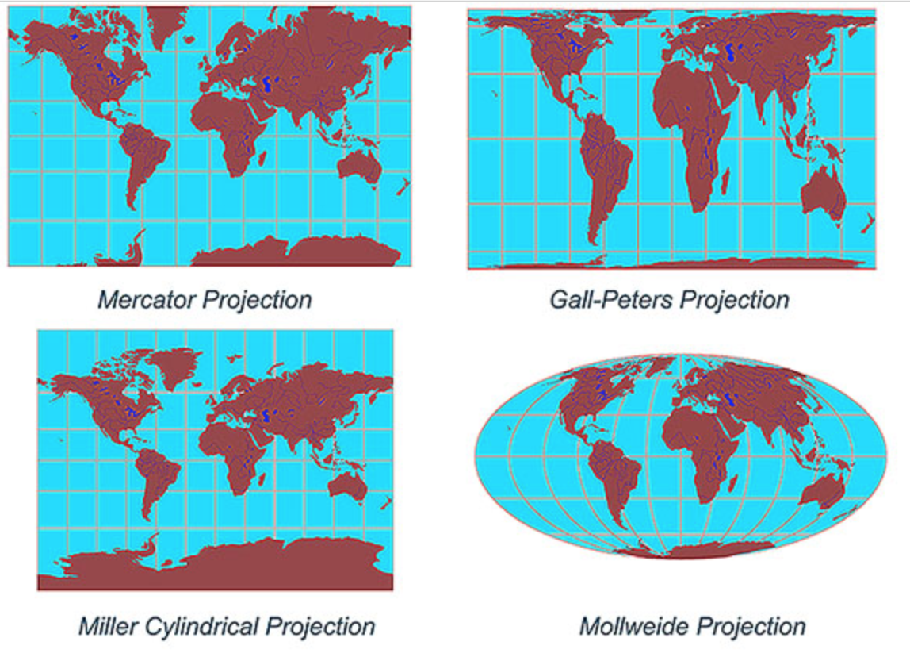
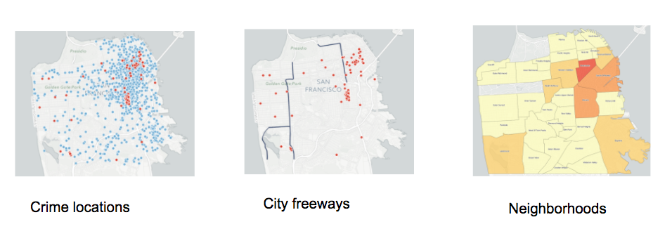

```{r setup, include=FALSE}
knitr::opts_chunk$set(echo = T)
```

## PREP

1. https://github.com/dlab-geo/r-geospatial-workshop

- Click *Clone or Download* and download the zip file
- Upzip the zip file and make a note of the folder in which it is located

2. Open RStudio and start a new script

3. Follow along by opening `r-geospatial-workshop-pt1-feb2018.html` in a browser window

4. Install required libraries in RStudio

```{r, eval=F}
install.packages(
  c("sp","rgdal","tmap","classInt","RColorBrewer",
    "ggplot2","leaflet", "ggmap"), dependencies=TRUE
)
```

# Geospatial Data in R

## Workshop Goals

* Brief Intro to geospatial data 

* Classes & methods for working with spatial data in R

* Mapping geospatial data

* Processing geospatial data

* Practice


## About Me

Patty Frontiera

[dlab.berkeley.edu](http://dlab.berkeley.edu)

## About you

Who are you?

Why are you here?


## Getting Started

1. Get the workshop files

https://github.com/dlab-geo/r-geospatial-workshop

- Click *Clone or Download* and download the zip file

- Upzip the zip file and make a note of the folder in which it is located

## Getting Started

2. Open RStudio and start a new script

3. Follow along by opening `r-geospatial-workshop-pt1-feb2018.html`

## Getting Started

4. In RStudio, install required libraries in RStudio

```{r, eval=F}

install.packages(
  c("sp","rgdal","tmap","classInt","RColorBrewer",
    "ggplot2","leaflet", "ggmap"), dependencies=TRUE
)

```


# Geographic Data


## Geographic Data

are data about *locations* on or near the surface of the *Earth*.

</img>


## Place names

convey geographic information but not specific location

</img>


## Geospatial data

represent location more specifically with **coordinates**

`46.130479, -117.134167`
  
</img>


## Coordinate Reference Systems

Coordinates only make sense when associated with a CRS!

## Coordinate Reference Systems

Define:

- the shape of the Earth

- the origin

- the units

- the relationship between the system and the real world


## Geographic CRS

</img>


## Geographic Coordinate Reference Systems

Define:
1. the shape: the major & minor axes of an ellipsoid
2. the origin: the equator and prime meridian
3. the datum: the fit of the CRS to the Earth
4. units: eg lat/lon expressed as decimal degrees or DMS

Because of variations in 1-3, there are **many** geographic CRSs!

## WGS84

The [World Geodetic System of 1984](https://en.wikipedia.org/wiki/World_Geodetic_System) is the default geographic CRS used today.

`WGS84` is the default CRS for most GIS software

 - Almost all data with lon/lat coordinates are assumed to be WGS84 unless otherwise specified

[NAD83](https://en.wikipedia.org/wiki/North_American_Datum#North_American_Datum_of_1983) is another common geographic CRS used by US agencies like the Census.

`WGS84` and `NAD83` are so similar that differences are often ignored except for applications requiring high locational accuracy.

## WGS84 vs NAD83

Why do you need to know?


## Map Projections

A `Projected CRS` applies a **map projection** to a Geographic CRS

`Map Projection`: mathematial transformation from curved to flat surface

</img>


## Many Map Projections & Projected CRSs

All introduce distortion, 

- in shape, area, distance, direction, or combo

- the larger the area the greater the distortion

No one map projection best for all purposes

Selection depends on location, extent and purpose

##  Different Projected CRSs

</img>


## Spatial Data

Spatial data is a more generic term that is not just for geographic data. 

## Spatial data are powerful because

- dynamically determine spatial metrics like area and length, 

- characteristics like distance and direction,

- relationships like inside and intersects from these data, and

- link data by spatial location!


# Types of Spatial Data

## Types of Spatial Data

Vector and Raster Data


## Vector Data

Points, lines and Polygons

</img>

## Raster Data

Regular grid of cells (or pixels)

</img>

* We won't be covering Raster data in this workshop*

## Softare for working with Geospatial Data

- Why special software?

## Software for working with Geospatial Data

Most software can only store, edit, query and analyze numbers and text

- Databases, spreadsheets, statistical software packages

## Geospatial data require

software that can import, create, store, edit, visualize and analyze geospatial data

- as geometric data types *referenced to the surface of the earth via CRSs*
    
- and methods to operate on those representations

## GIS

We call software for working with geospatial data **GIS**

**Geographic Information System**

This term is commonly associated with desktop software applications.

## Types of GIS

Desktop GIS - ArcGIS, QGIS

Software extended to support geospatial data - Tableau, R

Spatial Databases - Postgresql

Web GIS - ArcGIS Online, CARTO

Custom software - leaflet web maps

# Why R for Geospatial Data?

## Why R for Geospatial Data?

You already use R

Reproducibility 

Free & Open Source

Cutting edge 

Thousands of Cool add-ons

- Shiny, rleaflet


# Geospatial Data File formats

## Common File Formats

Vector points, lines & polygons:

* CSV
* [ESRI Shapefile](https://en.wikipedia.org/wiki/Shapefile)
* GeoJSON
* KML

Raster grids

* TIFF, GeoTiff
* JPEG, JPEG2000
* ASCII Grid

See [GIS file formats](https://en.wikipedia.org/wiki/GIS_file_formats)

## ESRI Shapefile

This is one of the most, if not the most common spatial vector data file formats.

</img>

Old but everywhere!

Gotchas: 2GB limit, 10 char column names, poor unicode support


## CSV (Comma Separated Values) Files

The simplest, most common format for point data

<pre>
"ID","name”,”x”,”y”,”taste","price","crowded","food"
"1","babette",-122.255374,37.868428,10,4,1,1
"2","musical",-122.260698,37.868383,7,3.25,1,1
"3","starbucks",-122.266057,37.870441,6,2.95,1,0
"4","yalis",-122.266385,37.873528,7,2.95,0,0
"5","berkeleyesp",-122.268681,37.873664,3,3.25,1,0
"6","fertile",-122.268863,37.874934,5,3.25,0,1
</pre>

# 3 Challenge Questions

## Question #1

- What columns contain the geographic data?
- What is the CRS for these data?

<pre>
"ID","name”,”x”,”y”,”taste","price","crowded","food"
"1","babette",-122.255374,37.868428,10,4,1,1
"2","musical",-122.260698,37.868383,7,3.25,1,1
"3","starbucks",-122.266057,37.870441,6,2.95,1,0
"4","yalis",-122.266385,37.873528,7,2.95,0,0
"5","berkeleyesp",-122.268681,37.873664,3,3.25,1,0
"6","fertile",-122.268863,37.874934,5,3.25,0,1
</pre>

## Question #2

- What's different?
- Does it matter?

<pre>
"ID","name”,”x”,”y”,”taste","price","crowded","food"
"1","babette",122.255374,37.868428,10,4,1,1
"2","musical",122.260698,37.868383,7,3.25,1,1
"3","starbucks",122.266057,37.870441,6,2.95,1,0
"4","yalis",122.266385,37.873528,7,2.95,0,0
"5","berkeleyesp",122.268681,37.873664,3,3.25,1,0
"6","fertile",122.268863,37.874934,5,3.25,0,1
</pre>

## Question #3

- What columns contain the geographic data?
- What is the CRS for these data?


# Geospatial Data in R

## Geospatial Data in R

There are many approaches to and packages for working with geospatial data in R.

One approach is to keep it simple and store geospatial data in a data frame.

This approach is most common when 

- the data are point data in CSV files and

- you want to map rather than spatially manipulate or analyze the data 

## About the Sample Data

**San Francisco Open Data Portal**
[https://data.sfgov.org](https://data.sfgov.org)

[SF Property Tax Rolls](https://data.sfgov.org/Housing-and-Buildings/Assessor-Historical-Secured-Property-Tax-Rolls/wv5m-vpq2)

This data set includes the Office of the Assessor-Recorder’s secured property tax roll spanning from 2007 to 2016.

We are using this as a proxy for home values.

## Load the CSV file into a data frame

*Set your working directory first to the folder where you downloaded the workshop files!*
```{r, eval=F }
sfhomes <- read.csv('data/sf_properties_25ksample.csv') 
head(sfhomes,6)
```

## Load the CSV file into a data frame

*Set your working directory first to the folder where you downloaded the workshop files!*
```{r }
sfhomes <- read.csv('data/sf_properties_25ksample.csv')  
str(sfhomes)

```

## Explore the data

```{r, eval=F}
class(sfhomes)   # what is the data object type?
dim(sfhomes)     # how many rows and columns
str(sfhomes)     # display the structure of the object
head(sfhomes)    # take a look at the first 10 records
summary(sfhomes) # explore the range of values
summary(sfhomes$totvalue) # explore the range of values for one column
hist(sfhomes$totvalue)    # histogram for the totvalue column
```

Questions:

- What columns make these data geospatial?
- Are they vector or raster data?
- What type of geometry? Points, lines, polygons, grid cells?
- What is the CRS of these data?


## Plot of points

Use the R base `plot` function to create a simple map
```{r, eval=FALSE}
plot(sfhomes$lon, sfhomes$lat) # using base plot function
```

## Plot of points

Use the R base `plot` function to create a simple map
```{r}
plot(sfhomes$lon, sfhomes$lat) # using base plot function
```


# `ggplot2`

## `ggplot2`

Most widely used plotting library in R

Not specifically for geospatial data

But can be used to make fabulous maps

Great choice if you already know `ggplot2`


## `ggplot2`

Load the library

```{r}
library(ggplot2)
```

## Maps with `ggplot2`

*What's different from the `plot()` map?*
```{r, eval=F}
library(ggplot2)

ggplot() + geom_point(data=sfhomes, aes(lon,lat)) + coord_map()

```


## Maps with `ggplot2`

*What's different from the `plot()` map?*
```{r}
ggplot() + geom_point(data=sfhomes, aes(lon,lat), size=1) + coord_map()
```

## `coord_map` option

Allows you to associate a map projection with geographic coord data.

</img>

## Non-coord map
```{r}
ggplot() + geom_point(data=sfhomes, aes(lon,lat), size=1) #+ coord_map()
```


## Map points symbolized by `totvalue`

```{r, eval=F}
ggplot() + geom_point(data=sfhomes, aes(lon,lat, col=totvalue)) + 
  coord_map()
```


## Map points symbolized by `totvalue`

```{r, echo=F}
ggplot() + 
  geom_point(data=sfhomes, aes(lon,lat, col=totvalue), size=1) + 
  coord_map()
```

## Data Order

*What's happening here?*  


```{r, eval=F}
sfhomes_low2high <- sfhomes[order(sfhomes$totvalue, decreasing = FALSE),]

ggplot() + 
  geom_point(data=sfhomes_low2high, aes(lon,lat, col=totvalue)) + 
  coord_map()
```

Try it - Does the output map look different from previous one?


## Data Order

The order of the data in the data frame changes the map display!

```{r, echo=F}
sfhomes_low2high <- sfhomes[order(sfhomes$totvalue, decreasing = FALSE),]

ggplot() + 
  geom_point(data=sfhomes_low2high, aes(lon,lat, col=totvalue)) + 
  coord_map()
```

## Challenge

Map the sfhomes data in decreasing order by `totvalue`.


## Decreasing order by `totvalue`

```{r}
sfhomes_high2low <- sfhomes[order(sfhomes$totvalue, decreasing = T),]
ggplot() + geom_point(data=sfhomes_high2low, aes(lon,lat, col=totvalue)) + 
  coord_map()
```

## More `ggplot` Goodness

What does this code do?
```{r, eval=F}
sfhomes2010_15 <- subset(sfhomes_low2high, as.numeric(SalesYear) > 2009)

ggplot() +
  geom_point(aes(lon, lat, col=totvalue), data = sfhomes2010_15 )  +
  facet_wrap(~ SalesYear)
```

## More `ggplot` Goodness

Visual spatial analysis!
```{r, echo=F}
sfhomes2010_15 <- subset(sfhomes_low2high, as.numeric(SalesYear) > 2009)

ggplot() +
  geom_point(aes(lon, lat, col=totvalue), data = sfhomes2010_15 )  +
  facet_wrap(~ SalesYear)
```

## Maps and Friends

It's a good idea to explore data values before and during mapping.
Sometimes maps aren't the best way or only way to visualize data.
```{r, eval=F}

ggplot(sfhomes2010_15, aes(totvalue)) + 
  geom_histogram() + 
  facet_wrap(~SalesYear)


boxplot(sfhomes$totvalue~sfhomes$SalesYear)

```


# ggmap

## `ggmap` extends `ggplot`

Create basemaps on which you can display your data.

Geocode place names and addresses to get point coordinates.

and more...

## ggmap

Load the libary
```{r}
library(ggmap)
```

## ggmap

Some functionality may require you to register a Google API key
See this [StackOverflow discussion](https://stackoverflow.com/questions/34402979/increase-the-api-limit-in-ggmaps-geocode-function-in-r)

```{r}
#devtools::install_github("dkahle/ggmap")
#library(ggmap)
#register_google(key="XXXXX") # your key here
```

```{r, echo=FALSE}
#devtools::install_github("dkahle/ggmap")
#library(ggmap)
#register_google(key="AIzXXXXXXXXXXXXXXXXXXXXXxPSE") # your key here

```

##  get_map

Fetch map data (default=Google) to plot using `get_map`

Use `?get_map` for details
```{r, eval=F}
sf_map <- get_map("San Francisco, CA")  
```

This use of the command leverages the Google Geocoding API to determine the coordinates of the named location.

##  get_map

Fetch map data (default=Google) to plot using `get_map`

Use `?get_map` for details
```{r}
sf_map <- get_map("San Francisco, CA")  
```


## Display the ggmap of SF

```{r, eval=F}
ggmap(sf_map)
```

## Display the ggmap of SF

```{r}
ggmap(sf_map)
```

## `ggmap` with point overlay

Syntax similar to `ggplot`

```{r, eval=F}
# ggplot() +

ggmap(sf_map) + 
  geom_point(data=sfhomes, aes(x=lon, y=lat, col=totvalue))

```

## `ggmap` with point overlay

```{r}
ggmap(sf_map) +
  geom_point(data=sfhomes, aes(x=lon, y=lat, col=totvalue))
```

## Customize `get_map`

Create a basemap zoomed to the extent of our data
```{r, eval=F}

# FIRST - subset the data
sfhomes15 <- subset(sfhomes, as.numeric(SalesYear) == 2015)

# Get the center point of the data
sf_ctr <- c(lon = mean(sfhomes$lon), lat = mean(sfhomes$lat))
sf_ctr  # take a look

# create the map
sf_basemap <- get_map(sf_ctr, zoom=12, scale=1)
```


## Customize `get_map` Extent

Get a basemap zoomed to the extent of the 2015 data
```{r}
# FIRST - subset the data
sfhomes15 <- subset(sfhomes, as.numeric(SalesYear) == 2015)

# Get the center point of the data
sf_ctr <- c(lon = mean(sfhomes15$lon), lat = mean(sfhomes15$lat))
sf_ctr  # take a look

# create the map
sf_basemap <- get_map(sf_ctr, zoom=12, scale=1)
```

## Challenge

Create a `ggmap` that uses customized `sf_basemap`


## Map the points with `sf_basemap`
```{r}
ggmap(sf_basemap) +
  geom_point(data=sfhomes15, aes(x=lon, y=lat, col=totvalue))
```


## Map Overlays

Finally, let's add another geospatial data layer to our `ggmap`. 

You can use this method to add as many layers as you want to a `ggmap` or `ggplot`.

## Bart Stations and Landmarks

Use the `read.csv` function to read in a file of Bart Station locations.

```{r}
bart <- read.csv("./data/bart.csv")
landmarks <- read.csv("./data/landmarks.csv")
# head (bart)
# head(landmarks)
```

## Add BART stations to map
```{r, eval=F}
ggmap(sf_basemap) +
  geom_point(data=sfhomes15, aes(x=lon, y=lat))  +
  geom_point(data=bart, aes(x=X,y=Y), col="red") +
  geom_point(data=landmarks, aes(x=X,y=Y), col="green")
```

## All good?

```{r, echo=F}
ggmap(sf_basemap) +
  geom_point(data=sfhomes15, aes(x=lon, y=lat))  +
  geom_point(data=bart, aes(x=X,y=Y), col="red") +
  geom_point(data=landmarks, aes(x=X,y=Y), col="green")
```

Questons?


# GGMap and GGPlot are great!

## BUT!

There are limits to what you can do with geospatial data stored in a data frame.


## Can't read & plot geospatial data files

The ESRI Shapefile is the most common file format for geospatial data.

Can't read in or **directly** plot data in a shapefile with `ggplot` or `ggmap`.


</img>

## Can't transform Coordinate Data

These data are not in geographic coordinates - longitude and latitude.

You can't map these with `ggmap`.


## Can't Perform Spatial Analysis

Spatial data objects and methods are needed to answer questions like

- What properties are in the Noe Valley neighborhood?

- What is the average property value in each SF neighborhood?

- What is the area of each SF Neighborhood and the property density?

- What properties are within walking distance (.25 miles) of the Mission neighborhood?


# Spatial Data Objects in R


# sp Package

## The `sp` Package

**Classes and Methods for Spatial Data**

The `SP` package is most commonly used to construct and manipulate spatial data objects in R. 

**Hundreds** of other R packages that do things with spatial data typically build on SP objects.


# sp package

## `sp` package

Load the library `sp`

Take a look at the different types of spatial object classes supported by `sp`

```{r, eval=F}
library(sp)
getClass("Spatial") 
```

## sp
```{r, echo=F}
library(sp)
getClass("Spatial") 
```


## sp Vector Objects

 Geometry | Spatial Object | Spatial Object with Attributes 
 ---------| --------------- | ------------------------------
 Points | SpatialPoints | SpatialPointsDataFrame 
 Lines | SpatialLines | SpatialLinesDataFrame 
 Polygons | SpatialPolygons | SpatialPolygonsDataFrame
 
<pre>

</pre>

We use the S*DF objects most frequently!


# From Data Frame to SpatialPointsDataFrame

## From Data Frame to SpatialPointsDataFrame

Let's transform the `sfhomes15` data frame to an `sp` object of type `SpatialPointsDataFrame`


## `sp::coordinates()` 

Use the `sp::coordinates()` method

- Sets or retrieves spatial coordinates

When transforming a DF to SPDF you are `setting` the coordinates.

**Note - the transformation happens in place!**

## Data Frame to SPDF

```{r, eval=F}

sfhomes15_sp <- sfhomes15  # Make a copy - why?

class(sfhomes15_sp)  # check the class of the object

coordinates(sfhomes15_sp) <- c('lon','lat')  #  Make it spatial - ORDER MATTERS!!

class(sfhomes15_sp)  # check the class of the object
```

## Data Frame to SPDF

```{r}

sfhomes15_sp <- sfhomes15  # Make a copy - why?

class(sfhomes15_sp)  # check the class of the object

coordinates(sfhomes15_sp) <- c('lon','lat')  #  Make it spatial - ORDER MATTERS!!

class(sfhomes15_sp)  # check the class of the object
```

## sp::coordinates()

You transformed a data frame to an SPDF using:
```
coordinates(sfhomes15_sp) <- c('lon','lat')
```

Now try this:
```
coordinates(sfhomes15_sp)
```
## sp::coordinates()
```{r}
coordinates(sfhomes15_sp)
```

## Compare the SPDF to DF

```
str(sfhomes15) # the data frame
```

```
str(sfhomes15_sp) # the data frame
```

## Compare the SPDF to DF
```{r}
str(sfhomes15) # the data frame
```

## SPDF
```{r}
str(sfhomes15_sp) # the SPDF
```
 

# SPDF Objects

## SPDF Objects

You can see from **str(sfhomes)** that a SPDF object is a collection of slots or components. The key ones are:

- `@data` data frame of attributes that describe each location
- `@coords` the coordinates for each geometric object - here points 
- `@bbox` the min and max bounding coordinates
- `@proj4string` the coordinate reference system defintion as a string

*Explore the object in the Environment window*

## SPDF Slots
 
Review the output of each of these:

```{r, eval=F}

summary(sfhomes15_sp)
head(sfhomes15_sp@data)
class(sfhomes15_sp@data)

sfhomes15_sp@bbox
bbox(sfhomes15_sp)

head(sfhomes15_sp@coords)
head(sfhomes15_sp$lat)
head(sfhomes15_sp$lon)

sfhomes15_sp@proj4string
proj4string(sfhomes15_sp)

```

## Take a closer look

Look at `sfhomes15_sp` in the environment window


## What's missing

Are all the columns that were present in `sfhomes15` also in `sfhomes15_sp`?

Is there a slot in `sfhomes15_sp` without data?


## What is the CRS of the data?
```{r}

proj4string(sfhomes15_sp) # get a CRS object

```

## Map an `SpatialPointsDataFrame`
```{r}
plot(sfhomes15_sp)  # using sp::plot
```

# So.....?

## Recap

We created great maps of sfhomes point data with `ggplot` and `ggmap`.

Then we created a simple map of the `SPDF` with `plot`.

We aren't seeing the value of `sp` objects just yet.

# Let's add more geospatial data

## Reading in Geospatial Data

There's an R package for that! 

## `rgdal`

`rgdal` is an R port of the powerful and widely used [GDAL](http://gdal.org) library.

It is the most commonly used R library for importing and exporting spatial data. 

* `OGR`: for vector data: readOGR() and writeOGR()

* `GDAL` for raster data: readGDAL() and writeGDAL()

## `rgdal`

```{r}

library(rgdal)

# See what file types are supported by rgdal drivers
# ogrDrivers()$name

```

## Getting help

gdal.org

`?readOGR`

For more info on working with `rgdal` to load different types of spatial data in R see this excellent [tutorial](http://zevross.com/blog/2016/01/13/tips-for-reading-spatial-files-into-r-with-rgdal/) by Zev Ross.

## Read in a Shapefile with the boundary of San Francisco

Take a look at the file(s)
```{r}

dir("data", pattern="sf_boundary")

```

## Read in Shapefile

```{r}

sfboundary <- readOGR(dsn="data",layer="sf_boundary")

# or
# sfboundary <- readOGR("data","sf_boundary")
# but not
#sfboundary <- readOGR(dsn="data/",layer="sf_boundary")

```


## Check out the data structure

What type of `sp` object is `sfboundary`?
How many `features` are in the object?

```{r, eval=F}
class(sfboundary)
str(sfboundary) 
head(sfboundary@data)  
```
*Explore the object in the Envi window*

## Make a quick plot of `sfboundary`

How?

## Make a quick plot of `sfboundary`
```{r}

plot(sfboundary)

```


```{r, eval=F, echo=F}
## Demonstration - A more complex `SpatialPolygonsDataFrame`
library(tigris)
calcounties <- counties(state="California", cb=T)
class(calcounties)
sf_cen <- subset(calcounties, COUNTYFP == "075")
plot(sf_cen)
head(sf_cen@data)
# Now look in Envi Window

```


## What is the the sfboundary CRS

Is it a geographic or projected CRS?

```{r, eval=F}

proj4string(sfboundary)

```

## Map both `sfboundary` & `sfhomes15_sp`
```{r}

plot(sfboundary)
points(sfhomes15_sp, col="red")

```

## Map both `sfboundary` & `sfhomes15_sp`

Where are the points? What's wrong?

```{r, eval=F}
plot(sfboundary)
points(sfhomes15_sp, col="red")
```

## What's Wrong?

Compare the CRSs, are they the same?

```{r, eval=F}

proj4string(sfboundary)
proj4string(sfhomes15_sp)
proj4string(sfboundary) == proj4string(sfhomes15_sp)

```

## Compare the CRSs, are they the same?

```{r}

proj4string(sfboundary)
proj4string(sfhomes15_sp)
proj4string(sfboundary) == proj4string(sfhomes15_sp)

```

## Compare the coordinate values

```{r}
sfboundary@bbox
sfhomes15_sp@bbox
```

## CRS Problems

The #1 reason...

</img>

## CRS Definitions

All `sp` objects should have a defined CRS

If not, one needs to be assigned to the object

- This is called `defining a projection`

- This doesn't change the coordinates

## CRS Transformations

All `sp` objects should have the same CRS.

- When they don't, they need to be transformed to a common CRS.

- This is called a **projection transformation**, 
    - or `projecting` or `reprojection`.

- Projection transformation returns a new spatial object with the transformed coordinates


## CRS Definitions and Transformations

GIS software - or software for working with geospatial data - will have a database of definitions for thousands of Earth referenced coordinate systems 

and methods for using those CRS definitions to define or transform a CRS.


## Defining a CRS

So, do we need to define the CRS of either

- `sfboundary` or 

- `sfhomes15_sp`?

If yes, which one? How can you tell?


## Defining a CRS

We need to know 

- what the appropriate CRS is
- how to define it as a CRS object
- how to assign it to an `sp` object

## What is the CRS

```{r}
bbox(sfhomes15_sp)
```

## Defining a CRS

Use the `sp` function `CRS()` to define a coordinate reference system

- requires as input a string that defines the CRS parameters

Then, use the `sp` function `proj4string()` to assign it

```{r}

proj4string(sfhomes15_sp) <- CRS("+proj=longlat 
                               +ellps=WGS84 +datum=WGS84 +no_defs")  
```

## WGS84 CRS

The WGS84 geographic coordinate referenece system can be defined by:

1. It's paramater string

```CRS("+proj=longlat +ellps=WGS84 +datum=WGS84 +no_defs")```

2. A code that can be used to look up the parameters

```CRS("+init=epsg:4326")``` 

*EPSG* refers to the group that defined these

- European Petroleum Survey Group

##  EPSG Example

EPSG codes are more commonly used. Can you guess why?
```{r, eval=F}

# use an EPSG code for WGS84
proj4string(sfhomes15_sp) <- CRS("+init=epsg:4326") 

# or enter the parameter string
# proj4string(sfhomes15_sp) <- CRS("+proj=longlat 
#                               +ellps=WGS84 +datum=WGS84 +no_defs")  
```

## Proj4 CRS Definitions

[Proj4](http://proj4.org/) is the standard library for defining and transforming map projections and coordinate reference systems.

[Here](https://github.com/OSGeo/proj.4/blob/master/nad/epsg) is an example file of proj4 CRS definitions


## Check it

Once you set the CRS you can check it with the same function.

```{r}
proj4string(sfhomes15_sp)
```

## Recap

`proj4string()` can get or set the CRS

`CRS()` is used to define the CRS of an sp object

The following are equivalent
```{r, eval=F}
# Define the CRS with the parameter string
proj4string(sfhomes15_sp) <- CRS("+proj=longlat 
                              +ellps=WGS84 +datum=WGS84 +no_defs")  
```

```{r, eval=F}
# Define the CRS with an EPSG code for WGS84
proj4string(sfhomes15_sp) <- CRS("+init=epsg:4326") 
```

`epsg` codes are used as short-hand for CRSs definitions


## Compare the CRSs, again

Are they both defined? Equal?

```{r}

proj4string(sfboundary)
proj4string(sfhomes15_sp)
proj4string(sfboundary) == proj4string(sfhomes15_sp)

```


# Transforming a CRS

## Transform the CRS

Use `sp` function `spTransform`

Requires as input:

* a `sp` object to transform with a defined CRS
    
* a target CRS

Outputs a new spatial object with coordinate data in the target CRS

- It does not change the input data

## Transform `sfboundary`

Let's transform the CRS of `sfboundary` to be the same as that of `sfhomes15_sp`.

Why not the other way around?

```{r}

sfboundary_lonlat <- spTransform(sfboundary, CRS("+init=epsg:4326"))

```


## Did it work?

Do they match now? 

How will we know?

## Do the CRSs match?

```{r}
proj4string(sfhomes15_sp) == proj4string(sfboundary_lonlat)

```

## Overlay the data in space

```{r, eval=F}
plot(sfboundary_lonlat)
points(sfhomes15_sp, col="red")


```

## Overlay the data in space

Woo-hoo!

```{r, echo=F}
plot(sfboundary_lonlat)
points(sfhomes15_sp, col="red")

```

## So....

We can transform `sp` objects to the same CRS for mapping and spatial analysis (we'll get there!)


## Save `sfboundary_lonlat`

Use `writeOGR` to save `sfboundary_lonlat` to a new shapefile

See `?writeOGR` for help
```{r, eval=F}
# write transformed data to a new shapefile 
writeOGR(sfboundary_lonlat, 
          dsn = "data", 
          layer = "sfbounary_lonlat", 
          driver="ESRI Shapefile")

# is it there?
dir("data")
```


## Projections, CRS, oh my!

We want all data in the same CRS

Which one is best?

</img>


## Common CRS Codes

**Geographic CRSs**

* `4326` Geographic, WGS84 (default for lon/lat)

* `4269` Geographic, NAD83 (USA Fed agencies like Census)


**Projected CRSs**

* `5070` USA Contiguous Albers Equal Area Conic

* `3310` CA ALbers Equal Area

* `26910` UTM Zone 10, NAD83 (Northern Cal)

* `3857` Web Mercator (web maps)

## Finding CRS Codes

See [http://spatialreference.org/](http://spatialreference.org/)

Use this site to find EPSG codes and proj4 CRS strings

## Challenge

1. Use `coordinates` to convert the `landmarks` data frame to a SpatialPointsDataFrame
2. Use `proj4string` to define it's CRS as `3857` Web Mercator
3. Use  `spTransform` to transform the landmarks data to geographic coords (WGS84)
4. Add the landmarks to the last map we created.

## Challenge - solution
```{r, eval=F}
# Convert the DF to a SPDF
coordinates(landmarks) <-c("X","Y")
# Define the CRS with an EPSG code for Web mercator
proj4string(landmarks) <- CRS("+init=epsg:3857") 
# Transform the CRS to WGS84
landmarks_lonlat <- spTransform(landmarks, CRS("+init=epsg:4326"))
# map it
plot(sfboundary_lonlat)
points(sfhomes15_sp, col="red")
points(landmarks_lonlat, col="green")
```

## Challenge - solution
```{r, echo=F}
# Convert the DF to a SPDF
coordinates(landmarks) <-c("X","Y")
# Define the CRS with an EPSG code for Web mercator
proj4string(landmarks) <- CRS("+init=epsg:3857") 
# Transform the CRS to WGS84
landmarks_lonlat <- spTransform(landmarks, CRS("+init=epsg:4326"))
# map it
plot(sfboundary_lonlat)
points(sfhomes15_sp, col="red")
points(landmarks_lonlat, col="green")
```

## Challenge 
1. Use `readOGR` to load the shapefile "data/sf_highways.shp"
2. Check its data type with `class()`
3. Check its CRS with  `proj4string()`
4. Use `spTransform` if need to project it to WGS84
2. Recreate the last map and add the highways as black `lines`

## Challenge - solution
```{r, eval=F}
highways <- readOGR(dsn="data", layer="sf_highways")
class(highways)
proj4string(highways)
highways_lonlat <- spTransform(highways, CRS("+init=epsg:4326"))

plot(sfboundary_lonlat)
lines(highways_lonlat, col="black")
points(sfhomes15_sp, col="red")
points(landmarks_lonlat, col="green")

```
## Challenge - solution

```{r, echo=F}
highways <- readOGR(dsn="data", layer="sf_highways")
class(highways)
proj4string(highways)
highways_lonlat <- spTransform(highways, CRS("+init=epsg:4326"))

plot(sfboundary_lonlat)
lines(highways_lonlat, col="black")
points(sfhomes15_sp, col="red")
points(landmarks_lonlat, col="green")

```
# QUESTIONS?

# Break.....


# Mapping Spatial Objects

## So far we have created maps with

`base::plot`, `ggplot`, `ggmap` for geospatial data in data frames

- great for creating maps given these types of data


`sp::plot` for `sp` objects

- meh, but great for a quick look at spatial data

## There is also sp::spplot

Use it to create quick maps

Can be used to create great maps 

- BUT complex, non-intuitive syntax = long ugly code

See examples in [sp Gallery: Plotting maps with sp](https://edzer.github.io/sp)

## spplot

```{r}
# map of the sfhomes data by totalvaue
spplot(sfhomes15_sp,"totvalue")
```

# tmap

## tmap

`tmap` stands for thematic map

Great maps with less code than the alternatives

Syntax should be familar to ggplot2 users, but simpler

Relatively easy to create interactive maps

## tmap starting points

- ?tmap
- vignette("tmap-nutshell")
- vignette("tmap-modes")
- [tmap in a Nutshell](https://cran.r-project.org/web/packages/tmap/vignettes/tmap-nutshell.html) 


## tmap

Load the library

```{r}
library(tmap)

```

## Quick tmap (qtm)

```{r}
qtm(sfhomes15_sp)
```

## Quick Interactive tmap

```{r}
tmap_mode("view")
qtm(sfhomes15_sp)
```

## Reset the mode to static plot

```{r}
tmap_mode("plot")
```

## Handy Shortcuts
```{r, eval=F}

ttm()       # Toggle Tmap mode between "interactive" and "plot"

last_map()  # display the last map 

```


## Plot mode

```{r}
tmap_mode("plot")
```


# Crafting Layered tmaps

## `tmap` Shapes and Graphic Elements

tmap's flexibility comes in how it intitively allows you to layer spatial data and style the layers by data attributes

Use `tm_shape(<sp_object>)`  to specifiy a geospatial data layer

Add `+ tm_<element>(...)` to style the layer by data values

...and other options for creating a publication ready map

## Exploring `tmap` functionality

?tmap_shape

?tmap_element

- ?tm_polygons (tm_fill, tm_borders)
- ?tm_symbols (tm_dots, etc...)

- [tmap in a Nutshell](https://cran.r-project.org/web/packages/tmap/vignettes/tmap-nutshell.html) 


## Mapping polygons

```{r}
tm_shape(sfboundary_lonlat) + 
  tm_polygons(col="beige", border.col="black")
```

## Mapping Points

```{r}
tm_shape(sfhomes15_sp) + 
  tm_dots(col="red", size=.25)
```

## Mapping Lines
```{r}
tm_shape(highways_lonlat) + 
  tm_lines(col="black")
```
## Mapping values

```{r, eval=F}
tm_shape(sfhomes15_sp) + 
  tm_dots(col="totvalue", size=.25)    # column names must be quoted
```

`tm_dots` are a type of `tm_symbols()`

See `?tm_symbols` for other types of point symbols.

## Mapping values

```{r}
tm_shape(sfhomes15_sp) + 
  tm_dots(col="totvalue", size=.25)  # columnn names **must** be quoted!
```


## Combining the layers
```{r, eval=F}
tm_shape(sfboundary_lonlat) + 
  tm_polygons(col="beige", border.col="black") +
tm_shape(highways_lonlat) + 
  tm_lines(col="black") +
tm_shape(sfhomes15_sp) + 
  tm_dots(col="totvalue", size=.25) 
 
```
## Combining the layers
```{r, echo=F}
tm_shape(sfboundary_lonlat) + 
  tm_polygons(col="beige", border.col="black") +
tm_shape(highways_lonlat) + 
  tm_lines(col="black") +
tm_shape(sfhomes15_sp) + 
  tm_dots(col="totvalue", size=.25) 
 
```

## Making it more Polished

```{r, eval=F}
tm_shape(sfboundary_lonlat) + 
  tm_polygons(col="beige", border.col="black") +
tm_shape(highways_lonlat) + 
  tm_lines(col="black") +
tm_shape(sfhomes15_sp) + 
  tm_dots(col="totvalue", size=.25, title = "San Francisco Property Values (2015)") + 
tm_layout(inner.margins=c(.05, .2, .15, .05)) # bottom, left, top, right
```

## Making it more Polished

```{r, echo=F}
tm_shape(sfboundary_lonlat) + 
  tm_polygons(col="beige", border.col="black") +
tm_shape(highways_lonlat) + 
  tm_lines(col="black") +
tm_shape(sfhomes15_sp) + 
  tm_dots(col="totvalue", size=.25, title = "San Francisco Property Values (2015)") + 
tm_layout(inner.margins=c(.05, .2, .15, .05)) # bottom, left, top, right
```

## Challenge

Add the `landmarks` to the previous `tmap`

Feel free to change the colors and title etc.

## Challenge - Solution

What does the **landmarks** layer tell you about the way `tmap` handles CRSs?
```{r, eval=F}
tm_shape(sfboundary_lonlat) + 
  tm_polygons(col="beige", border.col="black") +
tm_shape(highways_lonlat) + 
  tm_lines(col="black") +
tm_shape(sfhomes15_sp) + 
  tm_dots(col="totvalue", size=.25, 
          title = "San Francisco Property Values (2015)") + 
tm_shape(landmarks) +
  tm_markers(col="black", size=.4, text="name",text.just = "left") +
tm_layout(inner.margins=c(.05, .2, .15, .05)) # bottom, left, top, right
```
## Challenge - Solution

```{r, echo=F}
tm_shape(sfboundary_lonlat) + 
  tm_polygons(col="beige", border.col="black") +
tm_shape(highways_lonlat) + 
  tm_lines(col="black") +
tm_shape(sfhomes15_sp) + 
  tm_dots(col="totvalue", size=.25, title = "San Francisco Property Values (2015)") + 
tm_shape(landmarks) +
  tm_markers(col="black", size=.4, text="name",text.just = "left") +
tm_layout(inner.margins=c(.05, .2, .15, .05)) # bottom, left, top, right
```

## Challenge

Make the previous `tmap` interactive

## Challenge - Solution
```{r, eval=F}
ttm()       # Toggle Tmap mode between "interactive" and "plot"
last_map()  # display the last map 
```

## Challenge - Solution
```{r, echo=F}
ttm()       # Toggle Tmap mode between "interactive" and "plot"
last_map()  # display the last map 
```

## Improve the Popup

**popup.vars = 
      c("SalesYear","totvalue","NumBedrooms",
         "NumBathrooms","AreaSquareFeet")**

```{r, eval=F}
tm_shape(sfboundary_lonlat) + 
  tm_polygons(col="beige", border.col="black") +
tm_shape(highways_lonlat) + 
  tm_lines(col="black") +
tm_shape(sfhomes15_sp) + 
  tm_dots(col="totvalue", size=.25, 
          title = "San Francisco Property Values (2015)",
          popup.vars=c("SalesYear","totvalue","NumBedrooms",
                       "NumBathrooms","AreaSquareFeet")) + 
tm_shape(landmarks) +
  tm_markers(col="black", size=.4, text="name",text.just = "left") +
tm_layout(inner.margins=c(.05, .2, .15, .05)) # bottom, left, top, right
```

## Improve the Popup

```{r, echo=F}
tm_shape(sfboundary_lonlat) + 
  tm_polygons(col="beige", border.col="black") +
tm_shape(highways_lonlat) + 
  tm_lines(col="black") +
tm_shape(sfhomes15_sp) + 
  tm_dots(col="totvalue", size=.25, 
          title = "San Francisco Property Values (2015)",
          popup.vars=c("SalesYear","totvalue","NumBedrooms",
                       "NumBathrooms","AreaSquareFeet")) + 
tm_shape(landmarks) +
  tm_markers(col="black", size=.4, text="name",text.just = "left") +
tm_layout(inner.margins=c(.05, .2, .15, .05)) # bottom, left, top, right
```


## Save the map

Save it as an R object
```{r }
map1 <- last_map()
map1 # then display it
```

## Save `tmap` to file

Try this and then take a look at your files

```{r, eval=F}
save_tmap(map1, "sf_properties.png", height=6) # Static image file
save_tmap(map1, "sf_properties.html") # interactive web map
```

```{r, echo=F}
save_tmap(map1, "sf_properties.png", height=6) # Static image file
save_tmap(map1, "sf_properties.html") # interactive web map
```

## Publish your Map

Many ways to do this.

You can share you map online by publishing it to [RPubs](https://rpubs.com).

- You need to have an `RPubs` account to make that work.

1. Enter the name of your tmap object (`map1`) or your  `tmap` code in the console

2. In the `Viewer` window, click on the **Publish** icon.


## RPub Demo

```{r, eval=F}
tmap_mode("interactive")
map1 #  in console
```

[http://rpubs.com/pfrontiera/358110](http://rpubs.com/pfrontiera/358110)

# Questions?

## Save data for next workshop

```{r, eval=F}

# write transformed data objects to a new shapefile 
coordinates(bart) <- c("X","Y")
proj4string(bart) <- CRS(proj4string(sfboundary_lonlat))

save_layers <- c("sfhomes15_sp", "sfboundary_lonlat", "highways_lonlat", "bart", "landmarks")
for (i in save_layers){
  print(paste("Saving [",i,"] to file..."))
  writeOGR(get(i), 
          dsn = "saved_data", 
          layer = i, 
          driver="ESRI Shapefile")
}
# is it there?
dir("saved_data")

```


## Recap

- Geospatial Data in R
- CSV > Data Frame > ggplot/ggmap
- `sp` library - spatial objects and methods in R
- `GDAL` libary - readOGR, writeOGR
- Convert Data Frame to `SPDF`
- CRS definitions and transformations
- Map Overlays
- Geospatial Maps with `tmap`

# End of Part I


##

```{r, eval=F, echo=F}
## Output code to script
library(knitr)
purl("r-geospatial-workshop-feb2018-pt1.Rmd", output = "scripts/r-geospatial-workshop-feb2018-pt1.r", documentation = 1)
#purl("r-geospatial-workshop-feb2018-pt1.Rmd", output = "scripts/r-geospatial-workshop-feb2018-pt1.r", documentation = 0)
```
