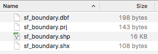

```{r setup, include=FALSE}
knitr::opts_chunk$set(echo = T)
```

## PREP

1. https://github.com/dlab-geo/r-geospatial-workshop

- Click *Clone or Download* and download the zip file
- Upzip the zip file and make a note of the folder in which it is located

2. Open RStudio and start a new script

3. Follow along by opening `r-geospatial-workshop-pt1-sp2018.html`

4. Install required libraries

```{r, eval=F}
install.packages(
  c("sp","rgdal","tmap","classInt","RColorBrewer",
    "ggplot2","leaflet", "ggmap"), dependencies=TRUE
)
```

# Geospatial Data in R

## Workshop Goals

* Intro to geospatial data 

* Intro to coordinate reference systems (CRS)

* Classes & methods for working with spatial data in R

* Mapping geospatial data

* Practice


## About Me

Patty Frontiera

[dlab.berkeley.edu](http://dlab.berkeley.edu)

## About you

Who are you?

Why are you here?


## Getting Started

1. Get the workshop files

https://github.com/dlab-geo/r-geospatial-workshop

- Click *Clone or Download* and download the zip file

- Upzip the zip file and make a note of the folder in which it is located

## Getting Started

2. Open RStudio and start a new script

3. Follow along by opening `r-geospatial-workshop-pt1-sp2018.html`

## Getting Started

4. In RStudio, install required libraries

```{r, eval=F}

install.packages(
  c("sp","rgdal","tmap","classInt","RColorBrewer",
    "ggplot2","leaflet", "ggmap"), dependencies=TRUE
)

```


# Geographic Data


## Geographic Data

are data about *locations* on or near the surface of the *Earth*.

</img>


## Place names

convey geographic information but don't **unambigously** specify location

</img>


## Geospatial data

represent location geometrically with **coordinates**

`46.130479, -117.134167`
  
</img>


## Coordinate Reference System

Coordinates indicate specific locations on the Earth when associated with a geographic `coordinate reference system` or **CRS**. 

</img>

## Geographic Coordinate Reference Systems

specify 

1. the shape of the Earth as the major & minor axes of an ellipsoid
2. the origin (0,0) - equator (~X), prime meridian (~Y)
3. fit of the CRS to the Earth (center of the earth), aka Datum
4. units, eg lat/lon expressed as decimal degrees or DMS

Because of variations in 1-3, there are **many** geographic CRSs!

## WGS84

The [World Geodetic System of 1984](https://en.wikipedia.org/wiki/World_Geodetic_System) is the default geographic CRS used today.

`WGS84` is the default CRS for most GIS software

Almost all data with lon/lat coordinates are assumed to be WGS84 unless otherwise specified

[NAD83] is another common geographic CRS used by US agencies like the Census.

`WGS84` and `NAD83` are so similar that differences are often ignored except for applications requiring high locational accuracy.


## Map Projections

A `Projected CRS` applies a **map projection** to a Geographic CRS

`Map Projection`: mathematial transformation from curved to flat surface

</img>


## Projected CRSs

There are many, many, many projected CRSs

All introduce distortion, eg in shape, area, distance, direction

No best one for all purposes

Selection depends on location, extent and purpose

##  Different Projected CRSs

</img>


## Spatial Data

Spatial data is a more generic term that is not just for geographic data. 

## Spatial data are powerful because

- dynamically determine spatial metrics like area and length, 
- characteristics like distance and direction, and 
- relationships like inside and intersects from these data.

# Types of Spatial Data


## Vector Data

Points, lines and Polygons

</img>

## Raster Data

Regular grid of cells (or pixels)

</img>

* We won't be covering Raster data in this workshop*

## Softare for working with Geospatial Data

- Why special software?

## Software for working with Geospatial Data

Most software can only query and analyze numbers and text

- Databases, spreadsheets, statistical software packages

## GIS - Geographic Information Systems

Software that can import, create, store, edit, visualize and analyze geospatial data

- data types/objects to represent geospatial data
    - locations represented with coordinates 
    - and referenced to the surface of the earth via CRSs
    
- methods to operate on those representations


## Types of GIS

Desktop GIS - ArcGIS, QGIS

Software extended to support geospatial data - Tableau, R

Spatial Databases - Postgresql

Web GIS - ArcGIS Online, CARTO

Custom software - leaflet web maps

# Why R for Geospatial Data?

## Why R for Geospatial Data?

You already use R

Reproducibility 

Free & Open Source

Cutting edge 

Thousands of Cool add-ons

- Shiny, rleaflet


# Geospatial Data File formats

## Common File Formats

Vector points, lines & polygons:

* CSV
* [ESRI Shapefile](https://en.wikipedia.org/wiki/Shapefile)
* GeoJSON
* KML

Raster grids

* TIFF, GeoTiff
* JPEG, JPEG2000
* ASCII Grid

See [GIS file formats](https://en.wikipedia.org/wiki/GIS_file_formats)

## ESRI Shapefile

This is one of the most, if not the most common spatial vector data file formats.

</img>

Old but everywhere!

Gotchas: 2GB limit, 10 char column names, poor unicode support


## CSV (Comma Separated Values) Files

The simplest, most common format for point data

<pre>
"ID","name”,”x”,”y”,”taste","price","crowded","food"
"1","babette",-122.255374,37.868428,10,4,1,1
"2","musical",-122.260698,37.868383,7,3.25,1,1
"3","starbucks",-122.266057,37.870441,6,2.95,1,0
"4","yalis",-122.266385,37.873528,7,2.95,0,0
"5","berkeleyesp",-122.268681,37.873664,3,3.25,1,0
"6","fertile",-122.268863,37.874934,5,3.25,0,1
</pre>

# Geospatial Data in R

## Geospatial Data in R

There are many approaches to and packages for working with geospatial data in R.

One approach is to keep it simple and store geospatial data in a data frame.

This approach is most common when the data are point data in CSV files.

## About the Sample Data

**San Francisco Open Data Portal**
[https://data.sfgov.org](https://data.sfgov.org)

[SF Property Tax Rolls](https://data.sfgov.org/Housing-and-Buildings/Assessor-Historical-Secured-Property-Tax-Rolls/wv5m-vpq2)

This data set includes the Office of the Assessor-Recorder’s secured property tax roll spanning from 2007 to 2016.

We are using this as a proxy for home values.

## Load the CSV file into a data frame
```{r, echo=F }
sfhomes <- read.csv('data/sf_properties.csv')
library(dplyr)
sfhomes <- sample_n(sfhomes, 25000)
```

```{r, eval=F }
sfhomes <- read.csv('data/sf_properties.csv')  
head(sfhomes,6)

```

## Explore the data

```{r, eval=F}
class(sfhomes) # what type of data object?
dim(sfhomes) # how many rows and columns
str(sfhomes) # display the structure of the object
head(sfhomes) # take a look at the first 10 records
summary(sfhomes) # explore the range of values
hist(sfhomes$totvalue)  # plot he range of values for the totvalue column
```

## Plot of points

```{r}
plot(sfhomes$lon, sfhomes$lat) # using base plot function
```

## Nice Maps with `ggplot2`

```{r}
library(ggplot2)

ggplot() + geom_point(data=sfhomes, aes(lon,lat), col="red", size=1)
```
 


## Color points by `totvalue`
```{r}
ggplot() + geom_point(data=sfhomes, aes(lon,lat, col=totvalue))
```


## Subset the Data

for `SalesYear` equal to 2015

```{r}
sfhomes15 <- subset(sfhomes, as.numeric(SalesYear) == 2015)

nrow(sfhomes15) # How many records?

```

## Always Explore
```{r}
hist(sfhomes15$totvalue) # What is the distribution of totvalue?
```

## Challenge - Make a map

of `sfhomes15` using `ggplot` and set the color to the `totvalue` column.

## 
```{r}
ggplot() + geom_point(data=sfhomes15, aes(x=lon, y=lat, col=totvalue))
```


## `ggmap` extends `ggplot`

Create basemaps on which you can display your data.

Geocode place names and addresses to get point coordinates.

and more...

## ggmap
```{r}
library(ggmap)

# fetch map data (default=Google) to plot
# ?get_map
sf_map <- get_map("San Francisco, CA")  
```

## Display the ggmap of SF
```{r}
ggmap(sf_map)
```

## Syntax similar to `ggplot`

```{r}
ggmap(sf_map) +
  geom_point(data=sfhomes15, aes(x=lon, y=lat, col=totvalue))

```

## Customize `get_map`

Create a basemap zoomed to the extent of our data
```{r}

# Get the center point of the data
sf_ctr <- c(lon = mean(sfhomes15$lon), lat = mean(sfhomes15$lat))
sf_ctr  # take a look

# create the map
sf_basemap <- get_map(sf_ctr, zoom=12, scale=1)
```

## Plot the basemap with the data overlay
```{r}
ggmap(sf_basemap) +
  geom_point(data=sfhomes15, aes(x=lon, y=lat, col=totvalue))
```

## Change the basemap

See `?get_map` to get available options
```{r}
sf_basemap_lite <- get_map(sf_ctr, zoom=12, scale=1, 
                            maptype = "toner-lite", source="stamen")
```

## Change the basemap

```{r}
ggmap(sf_basemap_lite) +
  geom_point(data=sfhomes15, aes(x=lon, y=lat, col=totvalue))

```


## Facets / Small Multiples / Micro Maps
```{r, eval=F}
# Let's look at last 5 years
sfhomes2010_2015 <- subset(sfhomes, as.numeric(SalesYear) > 2009)

ggmap(sf_basemap_lite) +
  geom_point(aes(lon, lat, col=totvalue), data = sfhomes2010_15 )  +
  facet_wrap(~ SalesYear)

```

```{r, echo=F}
# DO DONT SHOW
# Let's look at last 5 years
sfhomes2010_15 <- subset(sfhomes, as.numeric(SalesYear) > 2005)
```

## Facet/ Small Multiples / Micro Maps
```{r}
ggmap(sf_basemap_lite) +
  geom_point(aes(lon, lat, col=totvalue), data = sfhomes2010_15 )  +
  facet_wrap(~ SalesYear)

```

## Challenge

Redo above facet map with the following changes:

- Use data from 1995 - 1999
- Use a different basemap (eg maptype="terrain")

# Challenge
```{r}
sfhomes1995_1999 <- subset(sfhomes, (as.numeric(SalesYear) >= 1995) & (as.numeric(SalesYear) <= 1999))

ggmap(sf_basemap_lite) +
  geom_point(aes(lon, lat, col=totvalue), data = sfhomes1995_1999 )  +
  facet_wrap(~ SalesYear)
```

# GGMap and GGPlot are great but...

## BUT!

There are limits to what you can do with geospatial data stored in a dataframe

and mapping the data with `ggplot` and `ggmap`

## Can't read & plot geospatial data files

Shapefile is the most common format for non-point geospatial data.

Can't directly read or plot a shapefile with data frames/ggplot/ggmap

</img>

## Can't transform Coordinate Data


## Spatial Analysis

- What properties are within walking distance (.25 miles) of a BART station?

- Average sales price by census tract?

Most spatial operations require spatial objects and methods


# Spatial Data Objects in R


# sp Package

## The `sp` Package

**Classes and Methods for Spatial Data**

The `SP` package is most commonly used to construct and manipulate spatial data objects in R. 

**Hundreds** of other R packages that do things with spatial data typically build on SP objects.

# IMPORTANT ANNOUNCEMENT

## `sf` package

The `sf`, or `simple features` package in R has many improvements

Based on open standards for specifying spatial data

`ggplot` and `ggmap` can map `sf` spatial objects

But most spatial packages still depend on `sp`

So, live on the bleeding edge or check back in a year or so.

# `sp` package

## `sp` package

Take a look at the different types of spatial object classes supported by `sp`

```{r}
library(sp)
getClass("Spatial") 
```

```

## sp Vector Objects
 Geometry | Spatial Object | Spatial Object with Attributes 
 ---------| --------------- | ------------------------------
 Points | SpatialPoints | SpatialPointsDataFrame 
 Lines | SpatialLines | SpatialLinesDataFrame 
 Polygons | SpatialPolygons | SpatialPolygonsDataFrame
 
<pre>

</pre>

We use the S*DF objects most frequently!


# From Data Frame to SpatialPointsDataFrame

## From Data Frame to SpatialPointsDataFrame

Let's transform the sfhomes15 data frame to an `sp` object of type `SpatialPointsDataFrame`


## `sp::coordinates()` 

Use the `sp::coordinates()` method
- Sets or retrieves spatial coordinates

When transforming a DF to SPDF, requires 
- the object that will get the coordinates
- the names of the columns that contain the X and Y coordinates


## Data Frame to SPDF

```{r}

# First make a copy of the data frame
sfhomes15_sp <- sfhomes15

coordinates(sfhomes15_sp) <- c('lon','lat') # ORDER MATTERS!!

class(sfhomes15_sp) # check it
```

## sp::coordinates()

You transformed a data frame to an SPDF using:
```
coordinates(sfhomes15_sp) <- c('lon','lat')
```

Now try this:
```
coordinates(sfhomes15_sp)
```

## Compare the SPDF to DF
```{r}
str(sfhomes15) # the data frame
```

## SPDF
```{r}
str(sfhomes15_sp) # the SPDF
```
 

# SPDF Objects

## SPDF Objects

You can see from **str(sfhomes)** that a SPDF object is a collection of slots or components. The key ones are:

- `@data` data frame of attributes that describe each location
- `@coords` the coordinates for each geometric object - here points 
- `@bbox` the min and max bounding coordinates
- `@proj4string` the coordinate reference system defintion as a string

*Explore the object in the Environment window*

## SPDF Slots
 
Review the output of each of these:

```{r, eval=F}

summary(sfhomes15_sp)
head(sfhomes15_sp@data)
class(sfhomes15_sp@data)

sfhomes15_sp@bbox
bbox(sfhomes15_sp)

head(sfhomes15_sp@coords)
head(sfhomes15_sp$lat)
head(sfhomes15_sp$lon)

sfhomes15_sp@proj4string
proj4strings(sfhomes15_sp)

```

## Take a closer look

Look at `sfhomes15_sp` in the environment window


## What's missing

Are all the columns that were present in `sfhomes15` also in `sfhomes15_sp`?

Is there a slot in `sfhomes15_sp` without data?


## What is the CRS of the data?
```{r}

proj4string(sfhomes15_sp) # get a CRS object

```

## Map an `SpatialPointsDataFrame`
```{r}
plot(sfhomes15_sp)  # using sp::plot
```

# So.....?

## Recap

We created great maps of sfhomes point data with `ggplot` and `ggmap`.

Then we created a simple map of the `SPDF` with `plot`.

We aren't seeing the value of `sp` objects just yet.

# Let's add more geospatial data

## Reading in Geospatial Data

There's an R package for that! 

## `rgdal`

`rgdal` is an R port of the powerful and widely used [GDAL](http://gdal.org) library.

It is the most commonly used R library for importing and exporting spatial data. 

* `OGR`: for vector data: readOGR() and writeOGR()

* `GDAL` for raster data: readGDAL() and writeGDAL()

## `rgdal`

```{r}

library(rgdal)

# See what file types are supported by rgdal drivers
# ogrDrivers()$name

```

## Getting help

gdal.org

`?readOGR

For more info on working with `rgdal` to load different types of spatial data in R see this excellent [tutorial](http://zevross.com/blog/2016/01/13/tips-for-reading-spatial-files-into-r-with-rgdal/) by Zev Ross.

## Read in a Shapefile with the boundary of San Francisco

Take a look at the file(s)
```{r}

dir("data", pattern="sf_boundary")

```

## Read in Shapefile

```{r}

sfboundary <- readOGR(dsn="data",layer="sf_boundary")

# or
# sfboundary <- readOGR("data","sf_boundary")
# but not
#sfboundary <- readOGR(dsn="data/",layer="sf_boundary")

```


## Check out the data structure

What type of `sp` object is `sfboundary`?
How many `features` are in the object?

```{r, eval=F}
class(sfboundary)
str(sfboundary) 
head(sfboundary@data)  
```
*Explore the object in the Envi window*

## Make a quick plot of `sfboundary`

How?

## Make a quick plot of `sfboundary`
```{r}

plot(sfboundary)

```


## Demonstration - A more complex `SpatialPolygonsDataFrame`

```{r, eval=F}
library(tigris)
calcounties <- counties(state="California", cb=T)
class(calcounties)
sf_cen <- subset(calcounties, COUNTYFP == "075")
plot(sf_cen)
head(sf_cen@data)
# Now look in Envi Window

```


## What is the the sfboundary CRS

Is it a geographic or projected CRS?

```{r, eval=F}

proj4string(sfboundary)

```

## Map both `sfboundary` & `sfhomes15_sp`
```{r}

plot(sfboundary)
points(sfhomes15_sp, col="red")

```

## Map both `sfboundary` & `sfhomes15_sp`

Where are the points? What's wrong?

```{r, eval=F}
plot(sfboundary)
points(sfhomes15_sp, col="red")
```

## What's Wrong?

Compare the CRSs, are they the same?

```{r, eval=F}

proj4string(sfboundary)
proj4string(sfhomes15_sp)
proj4string(sfboundary) == proj4string(sfhomes15_sp)

```

## Compare the CRSs, are they the same?

```{r}

proj4string(sfboundary)
proj4string(sfhomes15_sp)
proj4string(sfboundary) == proj4string(sfhomes15_sp)

```

## Compare the coordinate values

```{r}
sfboundary@bbox
sfhomes15_sp@bbox
```

## CRS Problems

The #1 reason...

</img>

## CRS Definitions

All `sp` objects should have a defined CRS

If not, one needs to be assigned to the object
- This is called `defining a projection`.
- This doesn't change the coordinates.

## CRS Transformations

All `sp` objects should have the same CRS.

- When they don't, they need to be transformed to a common CRS.

- This is also called a projection transformation, 
    - or `projecting` or `reprojection`.
    
- Projection transformation returns a new spatial object with the transformed coordinates


## CRS Definitions and Transformations

Geospatial-aware software will have a database of definitions for thousands of Earth referenced coordinate systems


## Defining a CRS

We need to define the CRS of what `sp` object?
- `sfboundary` or `sfhomes15_sp`?

We need to know 
- the appropriate CRS for the data
- how to define the CRS
- how to assign it to the `sp` object


## Define a CRS

`sp` includes the `CRS()` function to define a CRS

- Two ways

```{r}

# use an EPSG code
proj4string(sfhomes15_sp) <- CRS("+init=epsg:4326") 

# or enter the proj4 string
# proj4string(sfhomes15_sp) <- CRS("+proj=longlat 
#                               +ellps=WGS84 +datum=WGS84 +no_defs")  
```


## check it

```{r}
proj4string(sfhomes15_sp)
```

## Notes

- `proj4string()` can get or set the CRS
- `proj4` is a library for managing map projections and CRSs
- `epsg` codes are used as short-hand for CRSs definitions


## Compare the CRSs, AGAIN

```{r}

proj4string(sfboundary)
proj4string(sfhomes15_sp)
proj4string(sfboundary) == proj4string(sfhomes15_sp)

```


# Transforming a CRS

## Transform the CRS

Use `sp` function `spTransform`

Requires as input:

* a `sp` object to transform with a defined CRS
    
* a target CRS

Outputs a new spatial object with coordinate data in the target CRS

- It does not change the input data

## Transform `sfboundary`

from `UTM10 CRS` to `WGS84`  (why?)
```{r}

sfboundary_lonlat <- spTransform(sfboundary, CRS("+init=epsg:4326"))

# or
# sfboundary_lonlat <- spTransform(sfboundary, 
#                              CRS(proj4string(sfhomes15_sp)))

```

*How do these two `spTransform` approaches differ?*

## Did it work?

How will we know?

## Do the CRSs match?

```{r, eval=F}
proj4string(sfhomes15_sp) == proj4string(sfboundary_lonlat)

```

## Overlay the data in space

```{r, eval=F}
plot(sfboundary_lonlat)
points(sfhomes15_sp, col="red")
points(sfhomes15_sp[sfhomes15_sp$totvalue<1000000,], col="green")

```

## Overlay the data in space

Woo-hoo!

```{r, echo=F}
plot(sfboundary_lonlat)
points(sfhomes15_sp, col="red")
points(sfhomes15_sp[sfhomes15_sp$totvalue<1000000,], col="green")

```

## So....

We can transform `sp` objects to the same CRS for mapping and spatial analysis (we'll get there!)


## Save `sfboundary_lonlat`

Use `writeOGR` to save `sfboundary_lonlat` to a new shapefile

See `?writeOGR` for help
```{r, eval=F}
# write transformed data to a new shapefile 
writeOGR(sfboundary_lonlat, 
          dsn = "data", 
          layer = "sfbounary_lonlat", 
          driver="ESRI Shapefile")

# is it there?
dir("data")
```


## Projections, CRS, oh my!

We want all data in the same CRS

Which one is best?

</img>


## Finding CRS Codes

See [http://spatialreference.org/](http://spatialreference.org/)

Use this site to find EPSG codes and proj4 CRS strings

## Common CRS Codes

**Geographic CRSs**

* `4326` Geographic, WGS84 (default for lon/lat)

* `4269` Geographic, NAD83 (USA Fed agencies like Census)

**Projected CRSs**

* `5070` USA Contiguous Albers Equal Area Conic

* `3310` CA ALbers Equal Area

* `26910` UTM Zone 10, NAD83 (Northern Cal)

* `3857` Web Mercator (web maps)


# QUESTIONS?

# Break.....


# Mapping Spatial Objects

## So far we have created maps with

`base::plot`, `ggplot`, `ggmap` for geospatial data in data frames

- great for creating maps given these types of data


`sp::plot` for `sp` objects

- meh, but great for a quick look at spatial data

## There is also sp::spplot

Use it to create quick maps

Can be used to create great maps 

- BUT complex, non-intuitive syntax = long ugly code

See examples in [sp Gallery: Plotting maps with sp](https://edzer.github.io/sp)

## spplot

```{r}
# map of the sfhomes data by totalvaue
spplot(sfhomes15_sp,"totvalue")
```

# tmap

## tmap

`tmap` stands for thematic map

Great maps with less code than the alternatives

Syntax should be familar to ggplot2 users, but simpler

Relatively easy to create interactive maps

## tmap starting points

- ?tmap
- vignette("tmap-nutshell")
- vignette("tmap-modes")
- [tmap in a Nutshell](https://cran.r-project.org/web/packages/tmap/vignettes/tmap-nutshell.html) 


## tmap

Load the library

```{r}
library(tmap)

```

## Quick tmap (qtm)

```{r}
qtm(sfhomes15_sp)
```

## Quick Interactive tmap

```{r}
tmap_mode("view")
qtm(sfhomes15_sp)
```

## Reset the mode to static plot

```{r}
tmap_mode("plot")
```


## Challenge

Create a static `qtm` of `sfboundary_lonlat`

- bonus, set the border color to black and the fill to beige

See `?qtm` for description of all options


## sfboundary_lonlat quickmap

```{r}
qtm(sfboundary_lonlat, borders="black", fill="beige")
```

# Crafting complex tmaps

## `tmap` Shapes and Graphic Elements

tmap's flexibility comes in how it intitively allows you to layer spatial data and style the layers by data attributes

Use `tm_shape(<sp_object>)`  to specifiy a geospatial data layer

Add `+ tm_<element>(...)` to style the layer by data values

...and other options for creating a publication ready map

## Exploring `tmap` functionality

?tmap_shape

?tmap_element

- ?tm_polygons (tm_fill, tm_borders)
- ?tm_symbols (tm_dots, etc...)

- [tmap in a Nutshell](https://cran.r-project.org/web/packages/tmap/vignettes/tmap-nutshell.html) 

## "Slow" tmaps
```{r}
tm_shape(sfboundary_lonlat) + tm_polygons(col="beige", border.col="black")
```

## `tmap` of totvalue

```{r}
tm_shape(sfhomes15_sp) + tm_dots(col="totvalue", size=.5)
```

## Challenge

Make the previous map interactive
- **NOTE**: columnn names must be quoted!

Zoom in on light & dark colored points to see if the corressponding `totvalue` makes sense.

## Reset the mode to static

```{r}
tmap_mode("plot")
```

## Overlaying layers

```{r}

tm_shape(sfboundary_lonlat) + tm_polygons(col="black", border.col="grey") + 
   tm_shape(sfhomes15_sp) + tm_dots(col="totvalue", size=.5)
```

## Challenge

Redo the last map but

change the legend title to "San Francisco Home Sales, 2015"

- hint: `title=`

# tmap and CRSs

## tmap and CRSs

We have been mapping data in WGS84 (lon/lat) CRS.

Not a great idea for static maps of larger areas as distortion becomes evident.

Let's explore that distortion and how to address with `tmap`

## US States

Let's load and map data for US states.

Data are in the file `data/us_states_pop.shp`


## Challenge

Use `readOGR` to load `data/us_states_pop.shp` into an `sp` object named `us_states`

## Read in & plot the Data
```{r}
us_states <- readOGR("./data", "us_states_pop")
```

## Take a quick look

```{r}
qtm(us_states)
```

## Questions

Review `us_states` with the `sp` commands we used earlier and / or explore in the Environment window.

- What type of `sp` object is `us_states`

- How many features does it contain?

- How many attributes describe those features?

- What is the CRS?


## Customizing the display

```{r}
tm_shape(us_states) + tm_polygons(col="grey", border.col = "white")
```

## CRS and Shape

Notice anything odd about shape of USA?
```{r, echo=F}
tm_shape(us_states) + tm_polygons(col="grey", border.col = "white")
```

## Dynamically Transforming the CRS

```{r}
tm_shape(us_states, projection="+init=epsg:5070") + tm_polygons(col="grey", border.col = "white")
```


## What's happening here?

```{r}
tm_shape(us_states, projection="+init=epsg:5070") + tm_polygons(col="grey", border.col = "white") +
tm_shape(us_states) + tm_borders(col="purple") 
```


## Dynamic CRS Transformations

Also called `On-the-fly reprojection` in ArcGIS & QGIS

Very cool!

BUT, if you want to use data in a different CRS it is best to transform it.

## Challenge

* Transform the `us_states` data to the USA Contiguous Albers CRS (5070),

* Save output as a new `SpatialPolygonsDataFrame` called `us_states_5070`

## us_states_5070
```{r}
us_states_5070 <- spTransform(us_states, CRS("+init=epsg:5070"))

```

## Plotting the Transformed Data

```{r}
tm_shape(us_states_5070) + tm_polygons(col="beige") +
  tm_shape(us_states) + tm_borders(col="purple")
```

# Questions?

## Recap

- Geospatial Data in R
- CSV > Data Frame > ggplot/ggmap
- GDAL, readOGR, writeOGR
- Data Frame to SDPF
- CRS definitions and transformations
- Overlays
- tmap

# End of Part I


## Output code to script

```{r, eval=F}
library(knitr)
purl("r-geospatial-workshop-sp2018-pt1.Rmd", output = "scripts/r-geospatial-workshop-sp2018-pt1.r", documentation = 1)
```
